# 🔬 Automated Skin Lesion & Dermatological Disease Classification
### *Deep Learning-Driven Computer Vision Pipeline for Clinical Diagnostic Assistance*

---

[](#)
[](#)
[](#)
[](#)
[](#)

---

## 📌 Executive Summary
Early and accurate detection of dermatological pathologies is critical for reducing diagnostic latency, triaging high-risk cases, and improving patient outcomes. This project delivers an end-to-end, production-grade Deep Learning pipeline designed to classify dermatological images across multiple diagnostic categories.

By leveraging state-of-the-art Convolutional Neural Network (CNN) and Transformer backbones alongside robust preprocessing and imbalance-handling strategies, this system serves as an objective, scalable decision-support framework for clinical workflows.

---

## 🎯 Core Project Objectives

* **High-Accuracy Triage & Classification:** Accurately identify and categorize skin lesions from dermoscopic and clinical imagery.
* **Class Imbalance Mitigation:** Implement advanced data augmentation, class weighting, and specialized loss functions (e.g., Focal Loss) to address real-world medical data skew.
* **Interpretability & Model Explainability:** Utilize visual attribution techniques (e.g., Grad-CAM) to ensure predictions are clinically interpretable and grounded in lesion morphology.
* **Edge & Production Optimization:** Prepare lightweight, quantized model artifacts (e.g., TFLite / ONNX) suitable for on-premise, web, or mobile deployment.

---

## 🏗️ End-to-End Pipeline Architecture

| Stage | Phase | Focus Area | Key Methodologies |
| :--- | :--- | :--- | :--- |
| **01** | **Ingestion & EDA** | Data Quality | Class distribution analysis, resolution standardization, artifact removal |
| **02** | **Preprocessing** | Augmentation | Color jittering, geometric transformations, normalization (ImageNet stats) |
| **03** | **Modeling** | Transfer Learning | Modern CNN / Transformer backbones (e.g., EfficientNet, MobileNet, ResNet) |
| **04** | **Optimization** | Fine-Tuning | Layer-wise unfreezing, Cosine Annealing, AdamW, Focal Loss |
| **05** | **Evaluation** | Diagnostics | Macro F1-Score, Balanced Accuracy, Per-Class Sensitivity, Confusion Matrix |
| **06** | **Deployment** | Inference Engine | Metric export, model serialization, quantization (FP16 / INT8) |

---

## 📊 Key Performance Indicators (KPIs)
To evaluate clinical efficacy, model performance is assessed against:
* **Balanced Accuracy & Macro F1-Score:** Ensuring minority pathological classes receive equal diagnostic weight.
* **High-Risk Sensitivity / Recall (e.g., Melanoma):** Minimizing false-negative rates on critical conditions.
* **Area Under the ROC Curve (AUC-ROC):** Assessing discrimination capability across varying confidence thresholds.

---

## 📋 Project Metadata

* **Author / Lead Engineer:** `[Bahri Ahmed Oualid]`
* **Dataset:** `[https://www.kaggle.com/datasets/hasnainjaved/melanoma-skin-cancer-dataset-of-10000-images]`
* **Target Classes:** `[ Melanoma, Melanocytic Nevus, Basal Cell Carcinoma, Actinic Keratosis]`
* **Base Architecture:** `[EfficientNet-B2 / MobileNetV2 / ResNet18]`
* **Target Deployment:** `[Mobile (TFLite) / Web API (FastAPI) / Embedded]`

---

> ⚠️ **Clinical & Ethical Disclaimer:**  
> *This notebook and associated models are intended for research, benchmarking, and clinical decision-support prototyping. They do not constitute certified medical devices and must not be used as a standalone replacement for professional dermatological examination.*


```python
# ==============================================================================
# 01. CORE SYSTEM & ENVIRONMENT IMPORTS
# ==============================================================================
import os
os.environ["PYTORCH_CUDA_ALLOC_CONF"] = "expandable_segments:True"
import sys
import gc
import time
import math
import random
import warnings
from pathlib import Path
from typing import Dict, List, Tuple, Any, Optional

import numpy as np
import pandas as pd
from PIL import Image
import cv2

import matplotlib.pyplot as plt
import seaborn as sns

import sklearn
from sklearn.model_selection import train_test_split, StratifiedKFold
from sklearn.preprocessing import StandardScaler, OneHotEncoder, LabelEncoder
from sklearn.impute import SimpleImputer
from sklearn.compose import ColumnTransformer
from sklearn.pipeline import Pipeline
from sklearn.ensemble import RandomForestClassifier
from sklearn.utils import class_weight
from sklearn.metrics import (
    accuracy_score, balanced_accuracy_score, classification_report,
    confusion_matrix, f1_score, recall_score, precision_score,
    roc_auc_score, roc_curve, auc
)

try:
    import xgboost as xgb
    XGB_AVAILABLE = True
except ImportError:
    XGB_AVAILABLE = False


import keras
from keras import layers, models, optimizers, callbacks, regularizers
import tensorflow as tf
os.environ["KERAS_BACKEND"] = "tensorflow"
gpus = tf.config.list_physical_devices('GPU')
for gpu in gpus:
    tf.config.experimental.set_memory_growth(gpu, True)
tf.config.set_visible_devices([], 'GPU')
warnings.filterwarnings('ignore', category=UserWarning)
warnings.filterwarnings('ignore', category=FutureWarning)
os.environ['TF_CPP_MIN_LOG_LEVEL'] = '2'

def set_global_seed(seed: int = 42) -> None:
    random.seed(seed)
    np.random.seed(seed)
    os.environ['PYTHONHASHSEED'] = str(seed)
    tf.random.set_seed(seed)

def setup_compute_device() -> str:
    gpus = tf.config.list_physical_devices('GPU')
    if gpus:
        try:
            for gpu in gpus:
                tf.config.experimental.set_memory_growth(gpu, True)
            device_info = f"GPU Active ({len(gpus)} device(s): {gpus[0].name})"
        except RuntimeError as e:
            device_info = f"GPU Configuration Error: {e}"
    else:
        device_info = "CPU Active (No GPU Detected)"
    return device_info

DIAGNOSIS_DICT: Dict[str, str] = {
    'nv': 'Melanocytic Nevi (Benign Mole)',
    'mel': 'Melanoma (Malignant Skin Cancer)',
    'bkl': 'Benign Keratosis-like Lesions',
    'bcc': 'Basal Cell Carcinoma (Malignant)',
    'akiec': 'Actinic Keratoses / Intraepithelial Carcinoma',
    'vasc': 'Vascular Lesions (Angiomas / Hemorrhages)',
    'df': 'Dermatofibroma (Benign)'
}

MALIGNANCY_RISK: Dict[str, str] = {
    'nv': 'Benign', 'mel': 'Malignant (Critical)', 'bkl': 'Benign',
    'bcc': 'Malignant', 'akiec': 'Pre-cancerous / In-situ',
    'vasc': 'Benign', 'df': 'Benign'
}

# ------------------------------------------------------------------
# KAGGLE-SPECIFIC PATHS: input is read-only, working is where you save
# ------------------------------------------------------------------
CONFIG: Dict[str, Any] = {
    "PROJECT_NAME": "HAM10000-Multimodal-Skin-Lesion-Classification",
    "SEED": 42,

    "ARTIFACTS_DIR": Path("/kaggle/working/artifacts"),
    "CHECKPOINT_DIR": Path("/kaggle/working/artifacts/checkpoints"),
    "MODELS_DIR": Path("/kaggle/working/artifacts/models"),
    "PLOTS_DIR": Path("/kaggle/working/artifacts/plots"),

    "IMAGE_SIZE": (224, 224),
    "IMAGE_CHANNELS": 3,
    "BATCH_SIZE": 16,
    "NUM_CLASSES": 7,
    "TARGET_COL": "dx",
    "METADATA_NUMERIC_COLS": ["age"],
    "METADATA_CATEGORICAL_COLS": ["sex", "localization"],

    "TRAIN_RATIO": 0.70,
    "VAL_RATIO": 0.15,
    "TEST_RATIO": 0.15,

    "CNN_BACKBONE": "EfficientNetB0",
    "INITIAL_LR": 1e-3,
    "AUTOTUNE": tf.data.AUTOTUNE
}

set_global_seed(CONFIG["SEED"])
hardware_status = setup_compute_device()

for folder in ["ARTIFACTS_DIR", "CHECKPOINT_DIR", "MODELS_DIR", "PLOTS_DIR"]:
    CONFIG[folder].mkdir(parents=True, exist_ok=True)

print("=" * 75)
print(f"🚀 MULTIMODAL SKIN CLASSIFICATION PIPELINE INITIALIZED")
print("=" * 75)
print(f" • Execution Device    : {hardware_status}")
print(f" • Python Version      : {sys.version.split()[0]}")
print(f" • TensorFlow Version  : {tf.__version__}")
print(f" • Keras Version       : {keras.__version__}")
print(f" • Target Classes (7)  : {', '.join(DIAGNOSIS_DICT.keys())}")
print(f" • Artifacts Path      : {CONFIG['ARTIFACTS_DIR'].resolve()}")
print("=" * 75)
```

    ===========================================================================
    🚀 MULTIMODAL SKIN CLASSIFICATION PIPELINE INITIALIZED
    ===========================================================================
     • Execution Device    : CPU Active (No GPU Detected)
     • Python Version      : 3.12.13
     • TensorFlow Version  : 2.20.0
     • Keras Version       : 3.13.2
     • Target Classes (7)  : nv, mel, bkl, bcc, akiec, vasc, df
     • Artifacts Path      : /kaggle/working/artifacts
    ===========================================================================
    

    2026-08-28 13:31:38.489653: E external/local_xla/xla/stream_executor/cuda/cuda_platform.cc:51] failed call to cuInit: INTERNAL: CUDA error: Failed call to cuInit: UNKNOWN ERROR (303)
    


```python
# ==============================================================================
# 07. DATA PATHS — Kaggle mounts the dataset read-only under /kaggle/input/
# ==============================================================================
DATASET_ROOT = Path("/kaggle/input/datasets/kmader/skin-cancer-mnist-ham10000")

METADATA_CSV_PATH = DATASET_ROOT / "HAM10000_metadata.csv"
IMAGES_DIR = [
    DATASET_ROOT / "HAM10000_images_part_1",
    DATASET_ROOT / "HAM10000_images_part_2",
]

# ==============================================================================
# 08. BUILD AN IMAGE LOOKUP (image_id -> full file path)
# ==============================================================================
image_lookup = {}
for d in IMAGES_DIR:
    if not d.exists():
        print(f" ⚠ Folder not found, skipping: {d}")
        continue
    for img_path in d.glob("*.jpg"):
        image_lookup[img_path.stem] = img_path

print(f" • Image folders scanned : {len(IMAGES_DIR)}")
print(f" • Total images found    : {len(image_lookup)}")

# ==============================================================================
# 09. LOAD METADATA
# ==============================================================================
metadata = pd.read_csv(METADATA_CSV_PATH)
print(f"\n • Shape    : {metadata.shape}")
print(f" • Columns  : {list(metadata.columns)}")
metadata.head()

# ==============================================================================
# 10. ATTACH IMAGE PATHS + VALIDATE
# ==============================================================================
metadata["image_path"] = metadata["image_id"].map(image_lookup)
metadata["image_exists"] = metadata["image_path"].notnull()

missing_images = (~metadata["image_exists"]).sum()
print(f"\n • Rows with missing image file : {missing_images} / {len(metadata)}")

if missing_images > 0:
    metadata = metadata[metadata["image_exists"]].reset_index(drop=True)

assert len(metadata) > 0, "No images matched — check DATASET_ROOT path."

# ==============================================================================
# 11. ENRICH + CLEAN
# ==============================================================================
metadata["dx_full_name"] = metadata[CONFIG["TARGET_COL"]].map(DIAGNOSIS_DICT)
metadata["malignancy_risk"] = metadata[CONFIG["TARGET_COL"]].map(MALIGNANCY_RISK)
metadata["age"] = metadata["age"].fillna(metadata["age"].median())
metadata = metadata.dropna(subset=CONFIG["METADATA_CATEGORICAL_COLS"]).reset_index(drop=True)

# ==============================================================================
# 12. CLASS DISTRIBUTION
# ==============================================================================
class_counts = metadata[CONFIG["TARGET_COL"]].value_counts()
print("\nClass distribution:")
print(class_counts)

fig, axes = plt.subplots(1, 2, figsize=(16, 5))
sns.countplot(data=metadata, x=CONFIG["TARGET_COL"], order=class_counts.index, ax=axes[0])
axes[0].set_title("Lesion type distribution (dx)")
sns.countplot(data=metadata, x="malignancy_risk",
              order=metadata["malignancy_risk"].value_counts().index, ax=axes[1])
axes[1].set_title("Malignancy risk distribution")
axes[1].tick_params(axis="x", rotation=20)
plt.tight_layout()
plt.savefig(CONFIG["PLOTS_DIR"] / "class_distribution.png", dpi=150)
plt.show()

# ==============================================================================
# 13. SAMPLE IMAGES PER CLASS
# ==============================================================================
fig, axes = plt.subplots(2, 4, figsize=(18, 9))
for ax, dx_code in zip(axes.flatten(), DIAGNOSIS_DICT.keys()):
    subset = metadata[metadata[CONFIG["TARGET_COL"]] == dx_code]
    if len(subset) == 0:
        ax.axis("off")
        continue
    sample_row = subset.sample(1, random_state=CONFIG["SEED"]).iloc[0]
    img = Image.open(sample_row["image_path"])
    ax.imshow(img)
    ax.set_title(f"{dx_code}\n{DIAGNOSIS_DICT[dx_code]}", fontsize=9)
    ax.axis("off")
axes.flatten()[-1].axis("off")
plt.tight_layout()
plt.savefig(CONFIG["PLOTS_DIR"] / "sample_images_per_class.png", dpi=150)
plt.show()

# ==============================================================================
# 14. SAVE CLEANED METADATA
# ==============================================================================
cleaned_path = CONFIG["ARTIFACTS_DIR"] / "ham10000_cleaned_metadata.csv"
metadata.to_csv(cleaned_path, index=False)
print(f"\n✅ PHASE 1 COMPLETE — cleaned metadata saved to: {cleaned_path}")
print(f" • Final shape: {metadata.shape}")
```

     • Image folders scanned : 2
     • Total images found    : 10015
    
     • Shape    : (10015, 7)
     • Columns  : ['lesion_id', 'image_id', 'dx', 'dx_type', 'age', 'sex', 'localization']
    
     • Rows with missing image file : 0 / 10015
    
    Class distribution:
    dx
    nv       6705
    mel      1113
    bkl      1099
    bcc       514
    akiec     327
    vasc      142
    df        115
    Name: count, dtype: int64
    


    
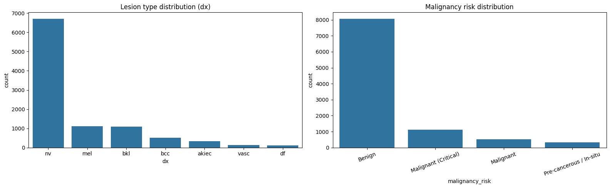
    


    
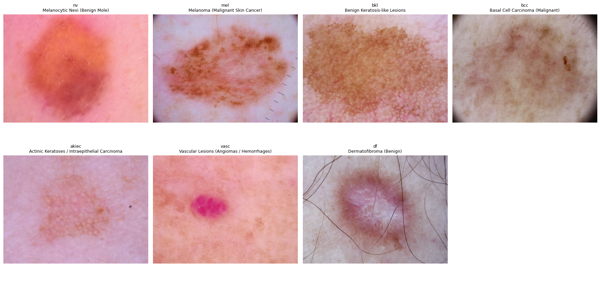
    


    
    ✅ PHASE 1 COMPLETE — cleaned metadata saved to: /kaggle/working/artifacts/ham10000_cleaned_metadata.csv
     • Final shape: (10015, 11)
    


```python
import os

for root, dirs, files in os.walk("/kaggle/input"):
    print(root, "->", len(files), "files")
```

    /kaggle/input -> 0 files
    /kaggle/input/notebooks -> 0 files
    /kaggle/input/notebooks/raniaioan -> 0 files
    /kaggle/input/notebooks/raniaioan/starter-skin-cancer-mnist-ham10000-6a5a3b01-0 -> 5 files
    /kaggle/input/notebooks/raniaioan/starter-skin-cancer-mnist-ham10000-6a5a3b01-0/__results___files -> 7 files
    /kaggle/input/datasets -> 0 files
    /kaggle/input/datasets/kmader -> 0 files
    /kaggle/input/datasets/kmader/skin-cancer-mnist-ham10000 -> 5 files
    /kaggle/input/datasets/kmader/skin-cancer-mnist-ham10000/HAM10000_images_part_1 -> 5000 files
    /kaggle/input/datasets/kmader/skin-cancer-mnist-ham10000/ham10000_images_part_1 -> 5000 files
    /kaggle/input/datasets/kmader/skin-cancer-mnist-ham10000/HAM10000_images_part_2 -> 5015 files
    /kaggle/input/datasets/kmader/skin-cancer-mnist-ham10000/ham10000_images_part_2 -> 5015 files
    


```python
# ==============================================================================
# 17. LOAD CLEANED METADATA (output of Cell 2)
# ==============================================================================
cleaned_path = CONFIG["ARTIFACTS_DIR"] / "ham10000_cleaned_metadata.csv"
metadata = pd.read_csv(cleaned_path)

print(f" • Loaded cleaned metadata : {metadata.shape}")
print(f" • Columns                 : {list(metadata.columns)}")

# ==============================================================================
# 18. ENCODE THE TARGET LABEL (dx: 7 text codes -> 7 numbers)
# ==============================================================================
label_encoder = LabelEncoder()
metadata["dx_encoded"] = label_encoder.fit_transform(metadata[CONFIG["TARGET_COL"]])

print("\nLabel mapping (code -> encoded number):")
for i, cls in enumerate(label_encoder.classes_):
    print(f"  {cls}  ->  {i}   ({DIAGNOSIS_DICT[cls]})")

# ==============================================================================
# 19. SELECT FEATURES — METADATA ONLY (no images in this baseline)
# ==============================================================================
feature_cols = CONFIG["METADATA_NUMERIC_COLS"] + CONFIG["METADATA_CATEGORICAL_COLS"]
X = metadata[feature_cols]
y = metadata["dx_encoded"]

print(f"\n • Features used : {feature_cols}")
print(f" • X shape        : {X.shape}")
print(f" • y shape        : {y.shape}")

# ==============================================================================
# 20. TRAIN / VALIDATION / TEST SPLIT (stratified — keeps class balance in each split)
# ==============================================================================
X_train, X_temp, y_train, y_temp = train_test_split(
    X, y,
    test_size=(CONFIG["VAL_RATIO"] + CONFIG["TEST_RATIO"]),
    stratify=y,
    random_state=CONFIG["SEED"]
)

relative_test_size = CONFIG["TEST_RATIO"] / (CONFIG["VAL_RATIO"] + CONFIG["TEST_RATIO"])
X_val, X_test, y_val, y_test = train_test_split(
    X_temp, y_temp,
    test_size=relative_test_size,
    stratify=y_temp,
    random_state=CONFIG["SEED"]
)

print(f"\n • Train set : {X_train.shape[0]} rows")
print(f" • Val set   : {X_val.shape[0]} rows")
print(f" • Test set  : {X_test.shape[0]} rows")

# ==============================================================================
# 21. PREPROCESSING PIPELINE (scale numeric, one-hot encode categorical)
# ==============================================================================
preprocessor = ColumnTransformer(transformers=[
    ("num", StandardScaler(), CONFIG["METADATA_NUMERIC_COLS"]),
    ("cat", OneHotEncoder(handle_unknown="ignore"), CONFIG["METADATA_CATEGORICAL_COLS"]),
])

# ==============================================================================
# 22. COMPUTE CLASS WEIGHTS (to counter the imbalance we saw in Cell 2's EDA)
# ==============================================================================
class_weights_array = class_weight.compute_class_weight(
    class_weight="balanced",
    classes=np.unique(y_train),
    y=y_train
)
class_weight_dict = dict(zip(np.unique(y_train), class_weights_array))

print("\nClass weights (higher = rarer class, gets more attention during training):")
for cls_idx, w in class_weight_dict.items():
    print(f"  {label_encoder.classes_[cls_idx]}  ->  {w:.2f}")

# ==============================================================================
# 23. TRAIN RANDOM FOREST BASELINE
# ==============================================================================
rf_pipeline = Pipeline(steps=[
    ("preprocessor", preprocessor),
    ("classifier", RandomForestClassifier(
        n_estimators=300,
        max_depth=12,
        class_weight=class_weight_dict,
        random_state=CONFIG["SEED"],
        n_jobs=-1
    ))
])

rf_pipeline.fit(X_train, y_train)
print("\n✅ Random Forest baseline trained.")

# ==============================================================================
# 24. TRAIN XGBOOST BASELINE (if available — for comparison)
# ==============================================================================
if XGB_AVAILABLE:
    sample_weights = np.array([class_weight_dict[label] for label in y_train])

    xgb_pipeline = Pipeline(steps=[
        ("preprocessor", preprocessor),
        ("classifier", xgb.XGBClassifier(
            n_estimators=300,
            max_depth=6,
            learning_rate=0.1,
            objective="multi:softprob",
            num_class=CONFIG["NUM_CLASSES"],
            random_state=CONFIG["SEED"],
            eval_metric="mlogloss"
        ))
    ])
    xgb_pipeline.fit(X_train, y_train, classifier__sample_weight=sample_weights)
    print("✅ XGBoost baseline trained.")
else:
    print("⚠ XGBoost not installed — skipping (pip install xgboost to enable).")

# ==============================================================================
# 25. EVALUATION FUNCTION (reused for both models)
# ==============================================================================
def evaluate_model(pipeline, X_eval, y_eval, model_name: str) -> Dict[str, float]:
    y_pred = pipeline.predict(X_eval)

    acc = accuracy_score(y_eval, y_pred)
    bal_acc = balanced_accuracy_score(y_eval, y_pred)
    recall_macro = recall_score(y_eval, y_pred, average="macro")
    f1_macro = f1_score(y_eval, y_pred, average="macro")

    print(f"\n{'=' * 60}")
    print(f"  {model_name} — Test Set Results")
    print(f"{'=' * 60}")
    print(f" • Accuracy           : {acc:.4f}")
    print(f" • Balanced Accuracy  : {bal_acc:.4f}   (fairer measure given class imbalance)")
    print(f" • Recall (macro avg) : {recall_macro:.4f}   (catching real positive cases — critical in medical diagnosis)")
    print(f" • F1 (macro avg)     : {f1_macro:.4f}")

    print(f"\nPer-class report:")
    print(classification_report(
        y_eval, y_pred,
        target_names=label_encoder.classes_,
        zero_division=0
    ))

    cm = confusion_matrix(y_eval, y_pred)
    plt.figure(figsize=(8, 6))
    sns.heatmap(
        cm, annot=True, fmt="d", cmap="Blues",
        xticklabels=label_encoder.classes_,
        yticklabels=label_encoder.classes_
    )
    plt.title(f"Confusion Matrix — {model_name}")
    plt.xlabel("Predicted")
    plt.ylabel("Actual")
    plt.tight_layout()
    plt.savefig(CONFIG["PLOTS_DIR"] / f"confusion_matrix_{model_name.replace(' ', '_').lower()}.png", dpi=150)
    plt.show()

    return {"accuracy": acc, "balanced_accuracy": bal_acc, "recall_macro": recall_macro, "f1_macro": f1_macro}

# ==============================================================================
# 26. RUN EVALUATION ON TEST SET
# ==============================================================================
rf_results = evaluate_model(rf_pipeline, X_test, y_test, "Random Forest (Metadata Only)")

if XGB_AVAILABLE:
    xgb_results = evaluate_model(xgb_pipeline, X_test, y_test, "XGBoost (Metadata Only)")

# ==============================================================================
# 27. SAVE THE BEST BASELINE MODEL + LABEL ENCODER FOR LATER USE
# ==============================================================================
import joblib

joblib.dump(rf_pipeline, CONFIG["MODELS_DIR"] / "baseline_random_forest.pkl")
joblib.dump(label_encoder, CONFIG["MODELS_DIR"] / "label_encoder.pkl")

if XGB_AVAILABLE:
    joblib.dump(xgb_pipeline, CONFIG["MODELS_DIR"] / "baseline_xgboost.pkl")

print(f"\n✅ PHASE 2 COMPLETE — baseline model(s) and label encoder saved to: {CONFIG['MODELS_DIR']}")
```

     • Loaded cleaned metadata : (10015, 11)
     • Columns                 : ['lesion_id', 'image_id', 'dx', 'dx_type', 'age', 'sex', 'localization', 'image_path', 'image_exists', 'dx_full_name', 'malignancy_risk']
    
    Label mapping (code -> encoded number):
      akiec  ->  0   (Actinic Keratoses / Intraepithelial Carcinoma)
      bcc  ->  1   (Basal Cell Carcinoma (Malignant))
      bkl  ->  2   (Benign Keratosis-like Lesions)
      df  ->  3   (Dermatofibroma (Benign))
      mel  ->  4   (Melanoma (Malignant Skin Cancer))
      nv  ->  5   (Melanocytic Nevi (Benign Mole))
      vasc  ->  6   (Vascular Lesions (Angiomas / Hemorrhages))
    
     • Features used : ['age', 'sex', 'localization']
     • X shape        : (10015, 3)
     • y shape        : (10015,)
    
     • Train set : 7010 rows
     • Val set   : 1502 rows
     • Test set  : 1503 rows
    
    Class weights (higher = rarer class, gets more attention during training):
      akiec  ->  4.37
      bcc  ->  2.78
      bkl  ->  1.30
      df  ->  12.36
      mel  ->  1.29
      nv  ->  0.21
      vasc  ->  10.12
    
    ✅ Random Forest baseline trained.
    ✅ XGBoost baseline trained.
    
    ============================================================
      Random Forest (Metadata Only) — Test Set Results
    ============================================================
     • Accuracy           : 0.4045
     • Balanced Accuracy  : 0.3733   (fairer measure given class imbalance)
     • Recall (macro avg) : 0.3733   (catching real positive cases — critical in medical diagnosis)
     • F1 (macro avg)     : 0.2420
    
    Per-class report:
                  precision    recall  f1-score   support
    
           akiec       0.17      0.47      0.25        49
             bcc       0.16      0.34      0.22        77
             bkl       0.30      0.16      0.21       165
              df       0.04      0.59      0.07        17
             mel       0.30      0.22      0.25       167
              nv       0.89      0.48      0.62      1006
            vasc       0.04      0.36      0.08        22
    
        accuracy                           0.40      1503
       macro avg       0.27      0.37      0.24      1503
    weighted avg       0.68      0.40      0.49      1503
    
    


    
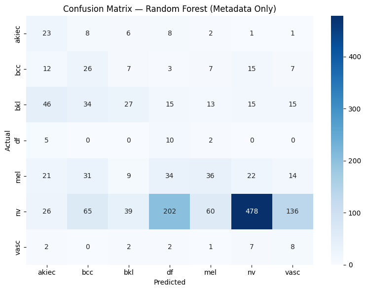
    


    
    ============================================================
      XGBoost (Metadata Only) — Test Set Results
    ============================================================
     • Accuracy           : 0.3752
     • Balanced Accuracy  : 0.3910   (fairer measure given class imbalance)
     • Recall (macro avg) : 0.3910   (catching real positive cases — critical in medical diagnosis)
     • F1 (macro avg)     : 0.2376
    
    Per-class report:
                  precision    recall  f1-score   support
    
           akiec       0.16      0.49      0.25        49
             bcc       0.14      0.35      0.20        77
             bkl       0.30      0.18      0.22       165
              df       0.04      0.71      0.08        17
             mel       0.30      0.23      0.26       167
              nv       0.90      0.42      0.58      1006
            vasc       0.04      0.36      0.08        22
    
        accuracy                           0.38      1503
       macro avg       0.27      0.39      0.24      1503
    weighted avg       0.68      0.38      0.46      1503
    
    


    
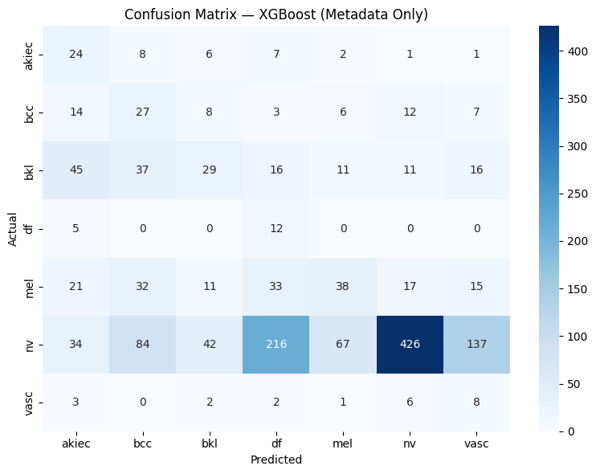
    


    
    ✅ PHASE 2 COMPLETE — baseline model(s) and label encoder saved to: /kaggle/working/artifacts/models
    


```python
# ==============================================================================
# 28. RELOAD CLEANED METADATA + LABEL ENCODER (keeps this cell self-contained)
# ==============================================================================
import joblib

cleaned_path = CONFIG["ARTIFACTS_DIR"] / "ham10000_cleaned_metadata.csv"
metadata = pd.read_csv(cleaned_path)

label_encoder = joblib.load(CONFIG["MODELS_DIR"] / "label_encoder.pkl")
metadata["dx_encoded"] = label_encoder.transform(metadata[CONFIG["TARGET_COL"]])

print(f" • Metadata reloaded : {metadata.shape}")

# ==============================================================================
# 29. TRAIN / VAL / TEST SPLIT (same ratios + seed as Cell 3, now with image paths)
# ==============================================================================
X = metadata[["image_path"]].copy()
y = metadata["dx_encoded"]

X_train, X_temp, y_train, y_temp = train_test_split(
    X, y,
    test_size=(CONFIG["VAL_RATIO"] + CONFIG["TEST_RATIO"]),
    stratify=y,
    random_state=CONFIG["SEED"]
)
relative_test_size = CONFIG["TEST_RATIO"] / (CONFIG["VAL_RATIO"] + CONFIG["TEST_RATIO"])
X_val, X_test, y_val, y_test = train_test_split(
    X_temp, y_temp,
    test_size=relative_test_size,
    stratify=y_temp,
    random_state=CONFIG["SEED"]
)

train_paths = X_train["image_path"].astype(str).values
val_paths   = X_val["image_path"].astype(str).values
test_paths  = X_test["image_path"].astype(str).values

train_labels = y_train.values
val_labels   = y_val.values
test_labels  = y_test.values

print(f" • Train : {len(train_paths)}  |  Val : {len(val_paths)}  |  Test : {len(test_paths)}")

# ==============================================================================
# 30. tf.data PIPELINE — loads + resizes images on the fly (memory efficient)
# ==============================================================================
def load_and_preprocess(path, label):
    image = tf.io.read_file(path)
    image = tf.image.decode_jpeg(image, channels=3)
    image = tf.image.resize(image, CONFIG["IMAGE_SIZE"])
    image = tf.cast(image, tf.float32)  # EfficientNet expects raw [0-255], normalizes internally
    return image, label

def make_dataset(paths, labels, shuffle: bool = False):
    ds = tf.data.Dataset.from_tensor_slices((paths, labels))
    if shuffle:
        ds = ds.shuffle(buffer_size=len(paths), seed=CONFIG["SEED"])
    ds = ds.map(load_and_preprocess, num_parallel_calls=CONFIG["AUTOTUNE"])
    ds = ds.batch(CONFIG["BATCH_SIZE"])
    ds = ds.prefetch(CONFIG["AUTOTUNE"])
    return ds

train_ds = make_dataset(train_paths, train_labels, shuffle=True)
val_ds   = make_dataset(val_paths, val_labels, shuffle=False)
test_ds  = make_dataset(test_paths, test_labels, shuffle=False)

print("\n✅ tf.data pipelines built.")

# ==============================================================================
# 31. CLASS WEIGHTS (same logic as Cell 3, recomputed here for training)
# ==============================================================================
class_weights_array = class_weight.compute_class_weight(
    class_weight="balanced",
    classes=np.unique(train_labels),
    y=train_labels
)
class_weight_dict = dict(zip(np.unique(train_labels).tolist(), class_weights_array.tolist()))

print("\nClass weights for CNN training:")
for cls_idx, w in class_weight_dict.items():
    print(f"  {label_encoder.classes_[cls_idx]}  ->  {w:.2f}")

# ==============================================================================
# 32. DATA AUGMENTATION (only active during training, off during val/test/inference)
# ==============================================================================
data_augmentation = keras.Sequential([
    layers.RandomFlip("horizontal_and_vertical"),
    layers.RandomRotation(0.15),
    layers.RandomZoom(0.15),
    layers.RandomContrast(0.1),
], name="data_augmentation")

# ==============================================================================
# 33. BUILD THE MODEL — EfficientNetB0 backbone (frozen) + custom classification head
# ==============================================================================
from keras.applications import EfficientNetB0

base_model = EfficientNetB0(
    include_top=False,
    weights="imagenet",
    input_shape=CONFIG["IMAGE_SIZE"] + (CONFIG["IMAGE_CHANNELS"],)
)
base_model.trainable = False  # freeze pretrained weights for the first training phase

inputs = keras.Input(shape=CONFIG["IMAGE_SIZE"] + (CONFIG["IMAGE_CHANNELS"],))
x = data_augmentation(inputs)
x = base_model(x, training=False)
x = layers.GlobalAveragePooling2D()(x)
x = layers.Dropout(0.3)(x)
x = layers.Dense(128, activation="relu")(x)
x = layers.Dropout(0.2)(x)
outputs = layers.Dense(CONFIG["NUM_CLASSES"], activation="softmax")(x)

cnn_model = keras.Model(inputs, outputs, name="EfficientNetB0_Skin_Lesion_CNN")

cnn_model.compile(
    optimizer=optimizers.Adam(learning_rate=CONFIG["INITIAL_LR"]),
    loss="sparse_categorical_crossentropy",
    metrics=["accuracy"]
)

cnn_model.summary()

# ==============================================================================
# 34. CALLBACKS
# ==============================================================================
class MemoryCleanupCallback(callbacks.Callback):
    def on_epoch_end(self, epoch, logs=None):
        gc.collect()

model_callbacks = [
    callbacks.ModelCheckpoint(
        filepath=str(CONFIG["CHECKPOINT_DIR"] / "best_cnn_model.keras"),
        monitor="val_loss", save_best_only=True, verbose=1
    ),
    callbacks.EarlyStopping(
        monitor="val_loss", patience=5, restore_best_weights=True, verbose=1
    ),
    callbacks.ReduceLROnPlateau(
        monitor="val_loss", factor=0.5, patience=3, min_lr=1e-6, verbose=1
    ),
    MemoryCleanupCallback(),   # <-- add the instance here
]
  

# ==============================================================================
# 35. PHASE A — TRAIN WITH FROZEN BASE (fast, teaches the new head)
# ==============================================================================
print("\n" + "=" * 75)
print("PHASE A: Training classification head (base model frozen)")
print("=" * 75)

history_phase_a = cnn_model.fit(
    train_ds,
    validation_data=val_ds,
    epochs=10,
    class_weight=class_weight_dict,
    callbacks=model_callbacks
)

# ==============================================================================
# 36. PHASE B — FINE-TUNE: unfreeze top layers of the backbone, train with lower LR
# ==============================================================================
print("\n" + "=" * 75)
print("PHASE B: Fine-tuning top layers of EfficientNetB0")
print("=" * 75)

base_model.trainable = True
fine_tune_at = len(base_model.layers) - 30  # unfreeze only the last 30 layers
for layer in base_model.layers[:fine_tune_at]:
    layer.trainable = False

cnn_model.compile(
    optimizer=optimizers.Adam(learning_rate=CONFIG["INITIAL_LR"] / 10),
    loss="sparse_categorical_crossentropy",
    metrics=["accuracy"]
)

history_phase_b = cnn_model.fit(
    train_ds,
    validation_data=val_ds,
    epochs=10,
    class_weight=class_weight_dict,
    callbacks=model_callbacks
)

# ==============================================================================
# 37. PLOT TRAINING CURVES (both phases combined)
# ==============================================================================
def combine_histories(h1, h2):
    combined = {}
    for key in h1.history:
        combined[key] = h1.history[key] + h2.history[key]
    return combined

full_history = combine_histories(history_phase_a, history_phase_b)

fig, axes = plt.subplots(1, 2, figsize=(14, 5))
axes[0].plot(full_history["accuracy"], label="Train")
axes[0].plot(full_history["val_accuracy"], label="Validation")
axes[0].axvline(x=10, color="gray", linestyle="--", label="Fine-tuning starts")
axes[0].set_title("CNN Accuracy over Training")
axes[0].set_xlabel("Epoch")
axes[0].set_ylabel("Accuracy")
axes[0].legend()

axes[1].plot(full_history["loss"], label="Train")
axes[1].plot(full_history["val_loss"], label="Validation")
axes[1].axvline(x=10, color="gray", linestyle="--", label="Fine-tuning starts")
axes[1].set_title("CNN Loss over Training")
axes[1].set_xlabel("Epoch")
axes[1].set_ylabel("Loss")
axes[1].legend()

plt.tight_layout()
plt.savefig(CONFIG["PLOTS_DIR"] / "cnn_training_curves.png", dpi=150)
plt.show()

# ==============================================================================
# 38. EVALUATE ON TEST SET
# ==============================================================================
y_pred_probs = cnn_model.predict(test_ds)
y_pred_cnn = np.argmax(y_pred_probs, axis=1)

acc = accuracy_score(test_labels, y_pred_cnn)
bal_acc = balanced_accuracy_score(test_labels, y_pred_cnn)
recall_macro = recall_score(test_labels, y_pred_cnn, average="macro")
f1_macro = f1_score(test_labels, y_pred_cnn, average="macro")

print(f"\n{'=' * 60}")
print("  CNN (EfficientNetB0, Images Only) — Test Set Results")
print(f"{'=' * 60}")
print(f" • Accuracy           : {acc:.4f}")
print(f" • Balanced Accuracy  : {bal_acc:.4f}")
print(f" • Recall (macro avg) : {recall_macro:.4f}")
print(f" • F1 (macro avg)     : {f1_macro:.4f}")

print(f"\nPer-class report:")
print(classification_report(
    test_labels, y_pred_cnn,
    target_names=label_encoder.classes_,
    zero_division=0
))

cm = confusion_matrix(test_labels, y_pred_cnn)
plt.figure(figsize=(8, 6))
sns.heatmap(
    cm, annot=True, fmt="d", cmap="Blues",
    xticklabels=label_encoder.classes_,
    yticklabels=label_encoder.classes_
)
plt.title("Confusion Matrix — CNN (Images Only)")
plt.xlabel("Predicted")
plt.ylabel("Actual")
plt.tight_layout()
plt.savefig(CONFIG["PLOTS_DIR"] / "confusion_matrix_cnn.png", dpi=150)
plt.show()

# ==============================================================================
# 39. SAVE THE TRAINED CNN
# ==============================================================================
cnn_model.save(CONFIG["MODELS_DIR"] / "cnn_efficientnetb0_final.keras")

print(f"\n✅ PHASE 3 COMPLETE — CNN model saved to: {CONFIG['MODELS_DIR']}")
```

     • Metadata reloaded : (10015, 12)
     • Train : 7010  |  Val : 1502  |  Test : 1503
    
    ✅ tf.data pipelines built.
    
    Class weights for CNN training:
      akiec  ->  4.37
      bcc  ->  2.78
      bkl  ->  1.30
      df  ->  12.36
      mel  ->  1.29
      nv  ->  0.21
      vasc  ->  10.12
    Downloading data from https://storage.googleapis.com/keras-applications/efficientnetb0_notop.h5
    16705208/16705208 ━━━━━━━━━━━━━━━━━━━━ 2s 0us/step
    


<pre style="white-space:pre;overflow-x:auto;line-height:normal;font-family:Menlo,'DejaVu Sans Mono',consolas,'Courier New',monospace"><span style="font-weight: bold">Model: "EfficientNetB0_Skin_Lesion_CNN"</span>
</pre>


<pre style="white-space:pre;overflow-x:auto;line-height:normal;font-family:Menlo,'DejaVu Sans Mono',consolas,'Courier New',monospace">┏━━━━━━━━━━━━━━━━━━━━━━━━━━━━━━━━━┳━━━━━━━━━━━━━━━━━━━━━━━━┳━━━━━━━━━━━━━━━┓
┃<span style="font-weight: bold"> Layer (type)                    </span>┃<span style="font-weight: bold"> Output Shape           </span>┃<span style="font-weight: bold">       Param # </span>┃
┡━━━━━━━━━━━━━━━━━━━━━━━━━━━━━━━━━╇━━━━━━━━━━━━━━━━━━━━━━━━╇━━━━━━━━━━━━━━━┩
│ input_layer_1 (<span style="color: #0087ff; text-decoration-color: #0087ff">InputLayer</span>)      │ (<span style="color: #00d7ff; text-decoration-color: #00d7ff">None</span>, <span style="color: #00af00; text-decoration-color: #00af00">224</span>, <span style="color: #00af00; text-decoration-color: #00af00">224</span>, <span style="color: #00af00; text-decoration-color: #00af00">3</span>)    │             <span style="color: #00af00; text-decoration-color: #00af00">0</span> │
├─────────────────────────────────┼────────────────────────┼───────────────┤
│ data_augmentation (<span style="color: #0087ff; text-decoration-color: #0087ff">Sequential</span>)  │ (<span style="color: #00d7ff; text-decoration-color: #00d7ff">None</span>, <span style="color: #00af00; text-decoration-color: #00af00">224</span>, <span style="color: #00af00; text-decoration-color: #00af00">224</span>, <span style="color: #00af00; text-decoration-color: #00af00">3</span>)    │             <span style="color: #00af00; text-decoration-color: #00af00">0</span> │
├─────────────────────────────────┼────────────────────────┼───────────────┤
│ efficientnetb0 (<span style="color: #0087ff; text-decoration-color: #0087ff">Functional</span>)     │ (<span style="color: #00d7ff; text-decoration-color: #00d7ff">None</span>, <span style="color: #00af00; text-decoration-color: #00af00">7</span>, <span style="color: #00af00; text-decoration-color: #00af00">7</span>, <span style="color: #00af00; text-decoration-color: #00af00">1280</span>)     │     <span style="color: #00af00; text-decoration-color: #00af00">4,049,571</span> │
├─────────────────────────────────┼────────────────────────┼───────────────┤
│ global_average_pooling2d        │ (<span style="color: #00d7ff; text-decoration-color: #00d7ff">None</span>, <span style="color: #00af00; text-decoration-color: #00af00">1280</span>)           │             <span style="color: #00af00; text-decoration-color: #00af00">0</span> │
│ (<span style="color: #0087ff; text-decoration-color: #0087ff">GlobalAveragePooling2D</span>)        │                        │               │
├─────────────────────────────────┼────────────────────────┼───────────────┤
│ dropout (<span style="color: #0087ff; text-decoration-color: #0087ff">Dropout</span>)               │ (<span style="color: #00d7ff; text-decoration-color: #00d7ff">None</span>, <span style="color: #00af00; text-decoration-color: #00af00">1280</span>)           │             <span style="color: #00af00; text-decoration-color: #00af00">0</span> │
├─────────────────────────────────┼────────────────────────┼───────────────┤
│ dense (<span style="color: #0087ff; text-decoration-color: #0087ff">Dense</span>)                   │ (<span style="color: #00d7ff; text-decoration-color: #00d7ff">None</span>, <span style="color: #00af00; text-decoration-color: #00af00">128</span>)            │       <span style="color: #00af00; text-decoration-color: #00af00">163,968</span> │
├─────────────────────────────────┼────────────────────────┼───────────────┤
│ dropout_1 (<span style="color: #0087ff; text-decoration-color: #0087ff">Dropout</span>)             │ (<span style="color: #00d7ff; text-decoration-color: #00d7ff">None</span>, <span style="color: #00af00; text-decoration-color: #00af00">128</span>)            │             <span style="color: #00af00; text-decoration-color: #00af00">0</span> │
├─────────────────────────────────┼────────────────────────┼───────────────┤
│ dense_1 (<span style="color: #0087ff; text-decoration-color: #0087ff">Dense</span>)                 │ (<span style="color: #00d7ff; text-decoration-color: #00d7ff">None</span>, <span style="color: #00af00; text-decoration-color: #00af00">7</span>)              │           <span style="color: #00af00; text-decoration-color: #00af00">903</span> │
└─────────────────────────────────┴────────────────────────┴───────────────┘
</pre>


<pre style="white-space:pre;overflow-x:auto;line-height:normal;font-family:Menlo,'DejaVu Sans Mono',consolas,'Courier New',monospace"><span style="font-weight: bold"> Total params: </span><span style="color: #00af00; text-decoration-color: #00af00">4,214,442</span> (16.08 MB)
</pre>


<pre style="white-space:pre;overflow-x:auto;line-height:normal;font-family:Menlo,'DejaVu Sans Mono',consolas,'Courier New',monospace"><span style="font-weight: bold"> Trainable params: </span><span style="color: #00af00; text-decoration-color: #00af00">164,871</span> (644.03 KB)
</pre>


<pre style="white-space:pre;overflow-x:auto;line-height:normal;font-family:Menlo,'DejaVu Sans Mono',consolas,'Courier New',monospace"><span style="font-weight: bold"> Non-trainable params: </span><span style="color: #00af00; text-decoration-color: #00af00">4,049,571</span> (15.45 MB)
</pre>


    
    ===========================================================================
    PHASE A: Training classification head (base model frozen)
    ===========================================================================
    Epoch 1/10
    439/439 ━━━━━━━━━━━━━━━━━━━━ 0s 426ms/step - accuracy: 0.3473 - loss: 1.8062
    Epoch 1: val_loss improved from None to 1.04729, saving model to /kaggle/working/artifacts/checkpoints/best_cnn_model.keras
    
    Epoch 1: finished saving model to /kaggle/working/artifacts/checkpoints/best_cnn_model.keras
    439/439 ━━━━━━━━━━━━━━━━━━━━ 239s 526ms/step - accuracy: 0.4110 - loss: 1.5691 - val_accuracy: 0.6032 - val_loss: 1.0473 - learning_rate: 0.0010
    Epoch 2/10
    439/439 ━━━━━━━━━━━━━━━━━━━━ 0s 439ms/step - accuracy: 0.4730 - loss: 1.3437
    Epoch 2: val_loss improved from 1.04729 to 1.01003, saving model to /kaggle/working/artifacts/checkpoints/best_cnn_model.keras
    
    Epoch 2: finished saving model to /kaggle/working/artifacts/checkpoints/best_cnn_model.keras
    439/439 ━━━━━━━━━━━━━━━━━━━━ 229s 520ms/step - accuracy: 0.4919 - loss: 1.3071 - val_accuracy: 0.6039 - val_loss: 1.0100 - learning_rate: 0.0010
    Epoch 3/10
    439/439 ━━━━━━━━━━━━━━━━━━━━ 0s 435ms/step - accuracy: 0.5092 - loss: 1.2400
    Epoch 3: val_loss improved from 1.01003 to 0.90938, saving model to /kaggle/working/artifacts/checkpoints/best_cnn_model.keras
    
    Epoch 3: finished saving model to /kaggle/working/artifacts/checkpoints/best_cnn_model.keras
    439/439 ━━━━━━━━━━━━━━━━━━━━ 233s 530ms/step - accuracy: 0.5117 - loss: 1.2195 - val_accuracy: 0.6338 - val_loss: 0.9094 - learning_rate: 0.0010
    Epoch 4/10
    439/439 ━━━━━━━━━━━━━━━━━━━━ 0s 429ms/step - accuracy: 0.5518 - loss: 1.1077
    Epoch 4: val_loss did not improve from 0.90938
    439/439 ━━━━━━━━━━━━━━━━━━━━ 223s 508ms/step - accuracy: 0.5392 - loss: 1.1486 - val_accuracy: 0.6365 - val_loss: 0.9251 - learning_rate: 0.0010
    Epoch 5/10
    439/439 ━━━━━━━━━━━━━━━━━━━━ 0s 435ms/step - accuracy: 0.5572 - loss: 1.1446
    Epoch 5: val_loss did not improve from 0.90938
    439/439 ━━━━━━━━━━━━━━━━━━━━ 233s 530ms/step - accuracy: 0.5485 - loss: 1.1206 - val_accuracy: 0.6052 - val_loss: 0.9301 - learning_rate: 0.0010
    Epoch 6/10
    439/439 ━━━━━━━━━━━━━━━━━━━━ 0s 443ms/step - accuracy: 0.5887 - loss: 1.0508
    Epoch 6: val_loss did not improve from 0.90938
    
    Epoch 6: ReduceLROnPlateau reducing learning rate to 0.0005000000237487257.
    439/439 ━━━━━━━━━━━━━━━━━━━━ 236s 538ms/step - accuracy: 0.5792 - loss: 1.0437 - val_accuracy: 0.6511 - val_loss: 0.9252 - learning_rate: 0.0010
    Epoch 7/10
    439/439 ━━━━━━━━━━━━━━━━━━━━ 0s 442ms/step - accuracy: 0.5869 - loss: 0.9897
    Epoch 7: val_loss improved from 0.90938 to 0.90865, saving model to /kaggle/working/artifacts/checkpoints/best_cnn_model.keras
    
    Epoch 7: finished saving model to /kaggle/working/artifacts/checkpoints/best_cnn_model.keras
    439/439 ━━━━━━━━━━━━━━━━━━━━ 232s 528ms/step - accuracy: 0.5827 - loss: 0.9989 - val_accuracy: 0.6198 - val_loss: 0.9087 - learning_rate: 5.0000e-04
    Epoch 8/10
    439/439 ━━━━━━━━━━━━━━━━━━━━ 0s 455ms/step - accuracy: 0.5955 - loss: 0.9673
    Epoch 8: val_loss improved from 0.90865 to 0.83509, saving model to /kaggle/working/artifacts/checkpoints/best_cnn_model.keras
    
    Epoch 8: finished saving model to /kaggle/working/artifacts/checkpoints/best_cnn_model.keras
    439/439 ━━━━━━━━━━━━━━━━━━━━ 239s 543ms/step - accuracy: 0.5933 - loss: 0.9769 - val_accuracy: 0.6458 - val_loss: 0.8351 - learning_rate: 5.0000e-04
    Epoch 9/10
    439/439 ━━━━━━━━━━━━━━━━━━━━ 0s 470ms/step - accuracy: 0.5938 - loss: 0.9135
    Epoch 9: val_loss did not improve from 0.83509
    439/439 ━━━━━━━━━━━━━━━━━━━━ 248s 564ms/step - accuracy: 0.5930 - loss: 0.9544 - val_accuracy: 0.6338 - val_loss: 0.8714 - learning_rate: 5.0000e-04
    Epoch 10/10
    439/439 ━━━━━━━━━━━━━━━━━━━━ 0s 446ms/step - accuracy: 0.5974 - loss: 0.9573
    Epoch 10: val_loss did not improve from 0.83509
    439/439 ━━━━━━━━━━━━━━━━━━━━ 231s 526ms/step - accuracy: 0.6011 - loss: 0.9599 - val_accuracy: 0.6438 - val_loss: 0.8402 - learning_rate: 5.0000e-04
    Restoring model weights from the end of the best epoch: 8.
    
    ===========================================================================
    PHASE B: Fine-tuning top layers of EfficientNetB0
    ===========================================================================
    Epoch 1/10
    439/439 ━━━━━━━━━━━━━━━━━━━━ 0s 529ms/step - accuracy: 0.4867 - loss: 1.5452
    Epoch 1: val_loss did not improve from 0.83509
    439/439 ━━━━━━━━━━━━━━━━━━━━ 280s 613ms/step - accuracy: 0.4926 - loss: 1.3221 - val_accuracy: 0.5300 - val_loss: 1.1528 - learning_rate: 1.0000e-04
    Epoch 2/10
    439/439 ━━━━━━━━━━━━━━━━━━━━ 0s 535ms/step - accuracy: 0.5389 - loss: 1.0837
    Epoch 2: val_loss did not improve from 0.83509
    439/439 ━━━━━━━━━━━━━━━━━━━━ 271s 618ms/step - accuracy: 0.5501 - loss: 1.0450 - val_accuracy: 0.6065 - val_loss: 0.9640 - learning_rate: 1.0000e-04
    Epoch 3/10
    439/439 ━━━━━━━━━━━━━━━━━━━━ 0s 533ms/step - accuracy: 0.5923 - loss: 0.9120
    Epoch 3: val_loss did not improve from 0.83509
    
    Epoch 3: ReduceLROnPlateau reducing learning rate to 4.999999873689376e-05.
    439/439 ━━━━━━━━━━━━━━━━━━━━ 272s 620ms/step - accuracy: 0.5989 - loss: 0.8992 - val_accuracy: 0.6152 - val_loss: 0.9151 - learning_rate: 1.0000e-04
    Epoch 4/10
    439/439 ━━━━━━━━━━━━━━━━━━━━ 0s 547ms/step - accuracy: 0.6297 - loss: 0.8230
    Epoch 4: val_loss did not improve from 0.83509
    439/439 ━━━━━━━━━━━━━━━━━━━━ 282s 642ms/step - accuracy: 0.6247 - loss: 0.8255 - val_accuracy: 0.6385 - val_loss: 0.9014 - learning_rate: 5.0000e-05
    Epoch 5/10
    439/439 ━━━━━━━━━━━━━━━━━━━━ 0s 552ms/step - accuracy: 0.6271 - loss: 0.8257
    Epoch 5: val_loss did not improve from 0.83509
    439/439 ━━━━━━━━━━━━━━━━━━━━ 284s 647ms/step - accuracy: 0.6278 - loss: 0.8033 - val_accuracy: 0.6551 - val_loss: 0.8585 - learning_rate: 5.0000e-05
    Epoch 5: early stopping
    Restoring model weights from the end of the best epoch: 1.
    


    
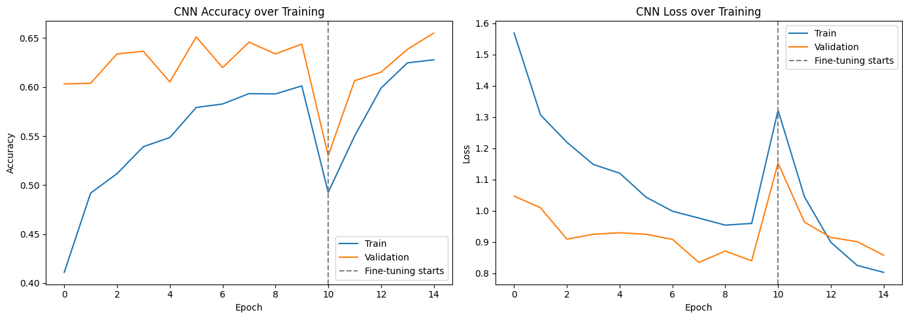
    


    94/94 ━━━━━━━━━━━━━━━━━━━━ 42s 433ms/step
    
    ============================================================
      CNN (EfficientNetB0, Images Only) — Test Set Results
    ============================================================
     • Accuracy           : 0.5150
     • Balanced Accuracy  : 0.5531
     • Recall (macro avg) : 0.5531
     • F1 (macro avg)     : 0.3983
    
    Per-class report:
                  precision    recall  f1-score   support
    
           akiec       0.34      0.43      0.38        49
             bcc       0.51      0.40      0.45        77
             bkl       0.40      0.58      0.47       165
              df       0.09      0.47      0.15        17
             mel       0.23      0.63      0.34       167
              nv       0.97      0.49      0.65      1006
            vasc       0.21      0.86      0.34        22
    
        accuracy                           0.51      1503
       macro avg       0.39      0.55      0.40      1503
    weighted avg       0.76      0.51      0.57      1503
    
    


    
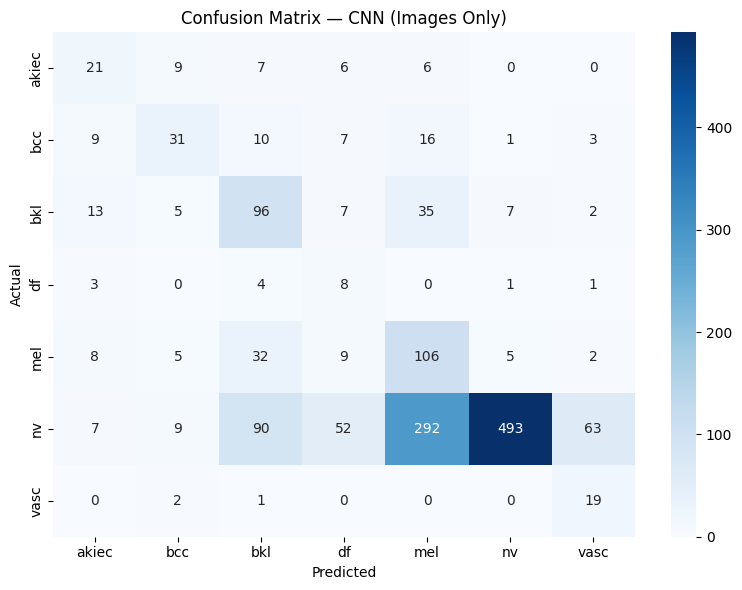
    


    
    ✅ PHASE 3 COMPLETE — CNN model saved to: /kaggle/working/artifacts/models
    


```python
# ==============================================================================
# 40. RELOAD EVERYTHING NEEDED (fresh kernel — nothing is in memory yet)
# ==============================================================================
import joblib
from keras.models import load_model

cleaned_path = CONFIG["ARTIFACTS_DIR"] / "ham10000_cleaned_metadata.csv"
metadata = pd.read_csv(cleaned_path)

label_encoder = joblib.load(CONFIG["MODELS_DIR"] / "label_encoder.pkl")
metadata["dx_encoded"] = label_encoder.transform(metadata[CONFIG["TARGET_COL"]])

cnn_model = load_model(CONFIG["CHECKPOINT_DIR"] / "best_cnn_model.keras")

print(f" • Metadata reloaded : {metadata.shape}")
print(f" • CNN reloaded      : {cnn_model.name}")

# ==============================================================================
# 41. RECREATE THE EXACT SAME TRAIN/VAL/TEST SPLIT (same seed = same rows)
# ==============================================================================
X_all = metadata.copy()
y_all = metadata["dx_encoded"]

train_df, temp_df, y_train, y_temp = train_test_split(
    X_all, y_all,
    test_size=(CONFIG["VAL_RATIO"] + CONFIG["TEST_RATIO"]),
    stratify=y_all,
    random_state=CONFIG["SEED"]
)
relative_test_size = CONFIG["TEST_RATIO"] / (CONFIG["VAL_RATIO"] + CONFIG["TEST_RATIO"])
val_df, test_df, y_val, y_test = train_test_split(
    temp_df, y_temp,
    test_size=relative_test_size,
    stratify=y_temp,
    random_state=CONFIG["SEED"]
)

print(f" • Train : {len(train_df)}  |  Val : {len(val_df)}  |  Test : {len(test_df)}")

# ==============================================================================
# 42. BUILD A FEATURE-EXTRACTOR MODEL (CNN, minus the final classification layers)
# ==============================================================================
feature_extractor = keras.Model(
    inputs=cnn_model.input,
    outputs=cnn_model.get_layer("global_average_pooling2d").output,
    name="cnn_feature_extractor"
)
feature_extractor.trainable = False  # frozen — we're only extracting, not training here

print(f"\n • Feature extractor output shape : {feature_extractor.output_shape}")

# ==============================================================================
# 43. IMAGE LOADING FUNCTION (same as Cell 4, no label needed here)
# ==============================================================================
def load_image_only(path):
    image = tf.io.read_file(path)
    image = tf.image.decode_jpeg(image, channels=3)
    image = tf.image.resize(image, CONFIG["IMAGE_SIZE"])
    image = tf.cast(image, tf.float32)
    return image

def make_image_dataset(paths):
    ds = tf.data.Dataset.from_tensor_slices(paths.astype(str))
    ds = ds.map(load_image_only, num_parallel_calls=CONFIG["AUTOTUNE"])
    ds = ds.batch(CONFIG["BATCH_SIZE"])
    ds = ds.prefetch(CONFIG["AUTOTUNE"])
    return ds

# ==============================================================================
# 44. EXTRACT IMAGE EMBEDDINGS FOR EACH SPLIT (runs once, then reused for all epochs)
# ==============================================================================
def extract_embeddings(df, split_name):
    ds = make_image_dataset(df["image_path"].values)
    print(f" • Extracting {split_name} embeddings ({len(df)} images)...")
    embeddings = feature_extractor.predict(ds, verbose=1)
    return embeddings

train_embeddings = extract_embeddings(train_df, "train")
val_embeddings   = extract_embeddings(val_df, "val")
test_embeddings  = extract_embeddings(test_df, "test")

print(f"\n • Embedding shape per image : {train_embeddings.shape[1]}")
gc.collect()

# ==============================================================================
# 45. BUILD METADATA FEATURES (same preprocessing logic as Cell 3's baseline)
# ==============================================================================
metadata_preprocessor = ColumnTransformer(transformers=[
    ("num", StandardScaler(), CONFIG["METADATA_NUMERIC_COLS"]),
    ("cat", OneHotEncoder(handle_unknown="ignore"), CONFIG["METADATA_CATEGORICAL_COLS"]),
])

train_meta_features = metadata_preprocessor.fit_transform(
    train_df[CONFIG["METADATA_NUMERIC_COLS"] + CONFIG["METADATA_CATEGORICAL_COLS"]]
)
val_meta_features = metadata_preprocessor.transform(
    val_df[CONFIG["METADATA_NUMERIC_COLS"] + CONFIG["METADATA_CATEGORICAL_COLS"]]
)
test_meta_features = metadata_preprocessor.transform(
    test_df[CONFIG["METADATA_NUMERIC_COLS"] + CONFIG["METADATA_CATEGORICAL_COLS"]]
)

# OneHotEncoder can return sparse matrices — ensure dense arrays for concatenation
train_meta_features = np.asarray(train_meta_features.todense() if hasattr(train_meta_features, "todense") else train_meta_features)
val_meta_features   = np.asarray(val_meta_features.todense() if hasattr(val_meta_features, "todense") else val_meta_features)
test_meta_features  = np.asarray(test_meta_features.todense() if hasattr(test_meta_features, "todense") else test_meta_features)

print(f" • Metadata feature shape : {train_meta_features.shape[1]}")

# ==============================================================================
# 46. FUSE: CONCATENATE IMAGE EMBEDDINGS + METADATA FEATURES
# ==============================================================================
X_train_fused = np.concatenate([train_embeddings, train_meta_features], axis=1)
X_val_fused   = np.concatenate([val_embeddings, val_meta_features], axis=1)
X_test_fused  = np.concatenate([test_embeddings, test_meta_features], axis=1)

y_train_arr = train_df["dx_encoded"].values
y_val_arr   = val_df["dx_encoded"].values
y_test_arr  = test_df["dx_encoded"].values

print(f"\n • Fused feature vector size : {X_train_fused.shape[1]}  "
      f"({train_embeddings.shape[1]} image + {train_meta_features.shape[1]} metadata)")

# ==============================================================================
# 47. CLASS WEIGHTS (same logic as before)
# ==============================================================================
class_weights_array = class_weight.compute_class_weight(
    class_weight="balanced", classes=np.unique(y_train_arr), y=y_train_arr
)
class_weight_dict = dict(zip(np.unique(y_train_arr).tolist(), class_weights_array.tolist()))

# ==============================================================================
# 48. BUILD THE FUSION HEAD (a small dense network on top of the fused vector)
# ==============================================================================
fusion_input = keras.Input(shape=(X_train_fused.shape[1],), name="fused_features")
x = layers.Dense(256, activation="relu")(fusion_input)
x = layers.BatchNormalization()(x)
x = layers.Dropout(0.4)(x)
x = layers.Dense(64, activation="relu")(x)
x = layers.Dropout(0.3)(x)
fusion_output = layers.Dense(CONFIG["NUM_CLASSES"], activation="softmax")(x)

fusion_model = keras.Model(fusion_input, fusion_output, name="Fusion_Image_Metadata_Model")

fusion_model.compile(
    optimizer=optimizers.Adam(learning_rate=1e-3),
    loss="sparse_categorical_crossentropy",
    metrics=["accuracy"]
)

fusion_model.summary()

# ==============================================================================
# 49. CALLBACKS
# ==============================================================================
class MemoryCleanupCallback(callbacks.Callback):
    def on_epoch_end(self, epoch, logs=None):
        gc.collect()

fusion_callbacks = [
    callbacks.ModelCheckpoint(
        filepath=str(CONFIG["CHECKPOINT_DIR"] / "best_fusion_model.keras"),
        monitor="val_loss", save_best_only=True, verbose=1
    ),
    callbacks.EarlyStopping(
        monitor="val_loss", patience=8, restore_best_weights=True, verbose=1
    ),
    callbacks.ReduceLROnPlateau(
        monitor="val_loss", factor=0.5, patience=4, min_lr=1e-6, verbose=1
    ),
    MemoryCleanupCallback(),
]

# ==============================================================================
# 50. TRAIN THE FUSION MODEL (fast — training on small feature vectors, not raw images)
# ==============================================================================
print("\n" + "=" * 75)
print("TRAINING FUSION MODEL (image embeddings + patient metadata)")
print("=" * 75)

fusion_history = fusion_model.fit(
    X_train_fused, y_train_arr,
    validation_data=(X_val_fused, y_val_arr),
    epochs=40,
    batch_size=32,
    class_weight=class_weight_dict,
    callbacks=fusion_callbacks
)

# ==============================================================================
# 51. TRAINING CURVES
# ==============================================================================
fig, axes = plt.subplots(1, 2, figsize=(14, 5))
axes[0].plot(fusion_history.history["accuracy"], label="Train")
axes[0].plot(fusion_history.history["val_accuracy"], label="Validation")
axes[0].set_title("Fusion Model Accuracy")
axes[0].set_xlabel("Epoch")
axes[0].legend()

axes[1].plot(fusion_history.history["loss"], label="Train")
axes[1].plot(fusion_history.history["val_loss"], label="Validation")
axes[1].set_title("Fusion Model Loss")
axes[1].set_xlabel("Epoch")
axes[1].legend()

plt.tight_layout()
plt.savefig(CONFIG["PLOTS_DIR"] / "fusion_training_curves.png", dpi=150)
plt.show()

# ==============================================================================
# 52. EVALUATE ON TEST SET
# ==============================================================================
y_pred_probs = fusion_model.predict(X_test_fused)
y_pred_fusion = np.argmax(y_pred_probs, axis=1)

acc = accuracy_score(y_test_arr, y_pred_fusion)
bal_acc = balanced_accuracy_score(y_test_arr, y_pred_fusion)
recall_macro = recall_score(y_test_arr, y_pred_fusion, average="macro")
f1_macro = f1_score(y_test_arr, y_pred_fusion, average="macro")

print(f"\n{'=' * 60}")
print("  FUSION MODEL (Image + Metadata) — Test Set Results")
print(f"{'=' * 60}")
print(f" • Accuracy           : {acc:.4f}")
print(f" • Balanced Accuracy  : {bal_acc:.4f}")
print(f" • Recall (macro avg) : {recall_macro:.4f}")
print(f" • F1 (macro avg)     : {f1_macro:.4f}")

print(f"\nPer-class report:")
print(classification_report(
    y_test_arr, y_pred_fusion,
    target_names=label_encoder.classes_,
    zero_division=0
))

cm = confusion_matrix(y_test_arr, y_pred_fusion)
plt.figure(figsize=(8, 6))
sns.heatmap(
    cm, annot=True, fmt="d", cmap="Blues",
    xticklabels=label_encoder.classes_,
    yticklabels=label_encoder.classes_
)
plt.title("Confusion Matrix — Fusion Model")
plt.xlabel("Predicted")
plt.ylabel("Actual")
plt.tight_layout()
plt.savefig(CONFIG["PLOTS_DIR"] / "confusion_matrix_fusion.png", dpi=150)
plt.show()

# ==============================================================================
# 53. SAVE THE FUSION MODEL + METADATA PREPROCESSOR
# ==============================================================================
fusion_model.save(CONFIG["MODELS_DIR"] / "fusion_model_final.keras")
joblib.dump(metadata_preprocessor, CONFIG["MODELS_DIR"] / "metadata_preprocessor.pkl")

print(f"\n✅ PHASE 4 COMPLETE — fusion model saved to: {CONFIG['MODELS_DIR']}")
```

     • Metadata reloaded : (10015, 12)
     • CNN reloaded      : EfficientNetB0_Skin_Lesion_CNN
     • Train : 7010  |  Val : 1502  |  Test : 1503
    
     • Feature extractor output shape : (None, 1280)
     • Extracting train embeddings (7010 images)...
    439/439 ━━━━━━━━━━━━━━━━━━━━ 174s 393ms/step
     • Extracting val embeddings (1502 images)...
    94/94 ━━━━━━━━━━━━━━━━━━━━ 37s 396ms/step
     • Extracting test embeddings (1503 images)...
    94/94 ━━━━━━━━━━━━━━━━━━━━ 38s 399ms/step
    
     • Embedding shape per image : 1280
     • Metadata feature shape : 19
    
     • Fused feature vector size : 1299  (1280 image + 19 metadata)
    


<pre style="white-space:pre;overflow-x:auto;line-height:normal;font-family:Menlo,'DejaVu Sans Mono',consolas,'Courier New',monospace"><span style="font-weight: bold">Model: "Fusion_Image_Metadata_Model"</span>
</pre>


<pre style="white-space:pre;overflow-x:auto;line-height:normal;font-family:Menlo,'DejaVu Sans Mono',consolas,'Courier New',monospace">┏━━━━━━━━━━━━━━━━━━━━━━━━━━━━━━━━━┳━━━━━━━━━━━━━━━━━━━━━━━━┳━━━━━━━━━━━━━━━┓
┃<span style="font-weight: bold"> Layer (type)                    </span>┃<span style="font-weight: bold"> Output Shape           </span>┃<span style="font-weight: bold">       Param # </span>┃
┡━━━━━━━━━━━━━━━━━━━━━━━━━━━━━━━━━╇━━━━━━━━━━━━━━━━━━━━━━━━╇━━━━━━━━━━━━━━━┩
│ fused_features (<span style="color: #0087ff; text-decoration-color: #0087ff">InputLayer</span>)     │ (<span style="color: #00d7ff; text-decoration-color: #00d7ff">None</span>, <span style="color: #00af00; text-decoration-color: #00af00">1299</span>)           │             <span style="color: #00af00; text-decoration-color: #00af00">0</span> │
├─────────────────────────────────┼────────────────────────┼───────────────┤
│ dense_2 (<span style="color: #0087ff; text-decoration-color: #0087ff">Dense</span>)                 │ (<span style="color: #00d7ff; text-decoration-color: #00d7ff">None</span>, <span style="color: #00af00; text-decoration-color: #00af00">256</span>)            │       <span style="color: #00af00; text-decoration-color: #00af00">332,800</span> │
├─────────────────────────────────┼────────────────────────┼───────────────┤
│ batch_normalization             │ (<span style="color: #00d7ff; text-decoration-color: #00d7ff">None</span>, <span style="color: #00af00; text-decoration-color: #00af00">256</span>)            │         <span style="color: #00af00; text-decoration-color: #00af00">1,024</span> │
│ (<span style="color: #0087ff; text-decoration-color: #0087ff">BatchNormalization</span>)            │                        │               │
├─────────────────────────────────┼────────────────────────┼───────────────┤
│ dropout_2 (<span style="color: #0087ff; text-decoration-color: #0087ff">Dropout</span>)             │ (<span style="color: #00d7ff; text-decoration-color: #00d7ff">None</span>, <span style="color: #00af00; text-decoration-color: #00af00">256</span>)            │             <span style="color: #00af00; text-decoration-color: #00af00">0</span> │
├─────────────────────────────────┼────────────────────────┼───────────────┤
│ dense_3 (<span style="color: #0087ff; text-decoration-color: #0087ff">Dense</span>)                 │ (<span style="color: #00d7ff; text-decoration-color: #00d7ff">None</span>, <span style="color: #00af00; text-decoration-color: #00af00">64</span>)             │        <span style="color: #00af00; text-decoration-color: #00af00">16,448</span> │
├─────────────────────────────────┼────────────────────────┼───────────────┤
│ dropout_3 (<span style="color: #0087ff; text-decoration-color: #0087ff">Dropout</span>)             │ (<span style="color: #00d7ff; text-decoration-color: #00d7ff">None</span>, <span style="color: #00af00; text-decoration-color: #00af00">64</span>)             │             <span style="color: #00af00; text-decoration-color: #00af00">0</span> │
├─────────────────────────────────┼────────────────────────┼───────────────┤
│ dense_4 (<span style="color: #0087ff; text-decoration-color: #0087ff">Dense</span>)                 │ (<span style="color: #00d7ff; text-decoration-color: #00d7ff">None</span>, <span style="color: #00af00; text-decoration-color: #00af00">7</span>)              │           <span style="color: #00af00; text-decoration-color: #00af00">455</span> │
└─────────────────────────────────┴────────────────────────┴───────────────┘
</pre>


<pre style="white-space:pre;overflow-x:auto;line-height:normal;font-family:Menlo,'DejaVu Sans Mono',consolas,'Courier New',monospace"><span style="font-weight: bold"> Total params: </span><span style="color: #00af00; text-decoration-color: #00af00">350,727</span> (1.34 MB)
</pre>


<pre style="white-space:pre;overflow-x:auto;line-height:normal;font-family:Menlo,'DejaVu Sans Mono',consolas,'Courier New',monospace"><span style="font-weight: bold"> Trainable params: </span><span style="color: #00af00; text-decoration-color: #00af00">350,215</span> (1.34 MB)
</pre>


<pre style="white-space:pre;overflow-x:auto;line-height:normal;font-family:Menlo,'DejaVu Sans Mono',consolas,'Courier New',monospace"><span style="font-weight: bold"> Non-trainable params: </span><span style="color: #00af00; text-decoration-color: #00af00">512</span> (2.00 KB)
</pre>


    
    ===========================================================================
    TRAINING FUSION MODEL (image embeddings + patient metadata)
    ===========================================================================
    Epoch 1/40
    216/220 ━━━━━━━━━━━━━━━━━━━━ 0s 5ms/step - accuracy: 0.3534 - loss: 2.1366
    Epoch 1: val_loss improved from None to 0.95888, saving model to /kaggle/working/artifacts/checkpoints/best_fusion_model.keras
    
    Epoch 1: finished saving model to /kaggle/working/artifacts/checkpoints/best_fusion_model.keras
    220/220 ━━━━━━━━━━━━━━━━━━━━ 3s 9ms/step - accuracy: 0.4103 - loss: 1.7415 - val_accuracy: 0.6285 - val_loss: 0.9589 - learning_rate: 0.0010
    Epoch 2/40
    214/220 ━━━━━━━━━━━━━━━━━━━━ 0s 5ms/step - accuracy: 0.5218 - loss: 1.2788
    Epoch 2: val_loss improved from 0.95888 to 0.93527, saving model to /kaggle/working/artifacts/checkpoints/best_fusion_model.keras
    
    Epoch 2: finished saving model to /kaggle/working/artifacts/checkpoints/best_fusion_model.keras
    220/220 ━━━━━━━━━━━━━━━━━━━━ 2s 8ms/step - accuracy: 0.5227 - loss: 1.2324 - val_accuracy: 0.6458 - val_loss: 0.9353 - learning_rate: 0.0010
    Epoch 3/40
    214/220 ━━━━━━━━━━━━━━━━━━━━ 0s 5ms/step - accuracy: 0.5556 - loss: 1.0753
    Epoch 3: val_loss improved from 0.93527 to 0.84653, saving model to /kaggle/working/artifacts/checkpoints/best_fusion_model.keras
    
    Epoch 3: finished saving model to /kaggle/working/artifacts/checkpoints/best_fusion_model.keras
    220/220 ━━━━━━━━━━━━━━━━━━━━ 2s 8ms/step - accuracy: 0.5660 - loss: 1.0368 - val_accuracy: 0.6784 - val_loss: 0.8465 - learning_rate: 0.0010
    Epoch 4/40
    215/220 ━━━━━━━━━━━━━━━━━━━━ 0s 5ms/step - accuracy: 0.5987 - loss: 0.9210
    Epoch 4: val_loss improved from 0.84653 to 0.83104, saving model to /kaggle/working/artifacts/checkpoints/best_fusion_model.keras
    
    Epoch 4: finished saving model to /kaggle/working/artifacts/checkpoints/best_fusion_model.keras
    220/220 ━━━━━━━━━━━━━━━━━━━━ 2s 8ms/step - accuracy: 0.5991 - loss: 0.9333 - val_accuracy: 0.6711 - val_loss: 0.8310 - learning_rate: 0.0010
    Epoch 5/40
    220/220 ━━━━━━━━━━━━━━━━━━━━ 0s 5ms/step - accuracy: 0.6192 - loss: 0.8651
    Epoch 5: val_loss did not improve from 0.83104
    220/220 ━━━━━━━━━━━━━━━━━━━━ 2s 8ms/step - accuracy: 0.6163 - loss: 0.8856 - val_accuracy: 0.6458 - val_loss: 0.8750 - learning_rate: 0.0010
    Epoch 6/40
    215/220 ━━━━━━━━━━━━━━━━━━━━ 0s 5ms/step - accuracy: 0.6370 - loss: 0.7829
    Epoch 6: val_loss improved from 0.83104 to 0.79022, saving model to /kaggle/working/artifacts/checkpoints/best_fusion_model.keras
    
    Epoch 6: finished saving model to /kaggle/working/artifacts/checkpoints/best_fusion_model.keras
    220/220 ━━━━━━━━━━━━━━━━━━━━ 2s 9ms/step - accuracy: 0.6332 - loss: 0.7890 - val_accuracy: 0.6704 - val_loss: 0.7902 - learning_rate: 0.0010
    Epoch 7/40
    215/220 ━━━━━━━━━━━━━━━━━━━━ 0s 5ms/step - accuracy: 0.6568 - loss: 0.7233
    Epoch 7: val_loss did not improve from 0.79022
    220/220 ━━━━━━━━━━━━━━━━━━━━ 2s 8ms/step - accuracy: 0.6599 - loss: 0.7384 - val_accuracy: 0.6245 - val_loss: 0.9361 - learning_rate: 0.0010
    Epoch 8/40
    215/220 ━━━━━━━━━━━━━━━━━━━━ 0s 5ms/step - accuracy: 0.6687 - loss: 0.6911
    Epoch 8: val_loss improved from 0.79022 to 0.71748, saving model to /kaggle/working/artifacts/checkpoints/best_fusion_model.keras
    
    Epoch 8: finished saving model to /kaggle/working/artifacts/checkpoints/best_fusion_model.keras
    220/220 ━━━━━━━━━━━━━━━━━━━━ 2s 8ms/step - accuracy: 0.6663 - loss: 0.6818 - val_accuracy: 0.7011 - val_loss: 0.7175 - learning_rate: 0.0010
    Epoch 9/40
    211/220 ━━━━━━━━━━━━━━━━━━━━ 0s 5ms/step - accuracy: 0.6763 - loss: 0.6469
    Epoch 9: val_loss did not improve from 0.71748
    220/220 ━━━━━━━━━━━━━━━━━━━━ 2s 8ms/step - accuracy: 0.6783 - loss: 0.6492 - val_accuracy: 0.6831 - val_loss: 0.7782 - learning_rate: 0.0010
    Epoch 10/40
    213/220 ━━━━━━━━━━━━━━━━━━━━ 0s 5ms/step - accuracy: 0.6785 - loss: 0.6447
    Epoch 10: val_loss did not improve from 0.71748
    220/220 ━━━━━━━━━━━━━━━━━━━━ 2s 8ms/step - accuracy: 0.6813 - loss: 0.6492 - val_accuracy: 0.6791 - val_loss: 0.8452 - learning_rate: 0.0010
    Epoch 11/40
    210/220 ━━━━━━━━━━━━━━━━━━━━ 0s 5ms/step - accuracy: 0.6896 - loss: 0.6581
    Epoch 11: val_loss did not improve from 0.71748
    220/220 ━━━━━━━━━━━━━━━━━━━━ 2s 8ms/step - accuracy: 0.6914 - loss: 0.6480 - val_accuracy: 0.6585 - val_loss: 0.8131 - learning_rate: 0.0010
    Epoch 12/40
    214/220 ━━━━━━━━━━━━━━━━━━━━ 0s 5ms/step - accuracy: 0.7034 - loss: 0.5880
    Epoch 12: val_loss improved from 0.71748 to 0.71724, saving model to /kaggle/working/artifacts/checkpoints/best_fusion_model.keras
    
    Epoch 12: finished saving model to /kaggle/working/artifacts/checkpoints/best_fusion_model.keras
    220/220 ━━━━━━━━━━━━━━━━━━━━ 2s 8ms/step - accuracy: 0.7019 - loss: 0.5955 - val_accuracy: 0.7137 - val_loss: 0.7172 - learning_rate: 0.0010
    Epoch 13/40
    217/220 ━━━━━━━━━━━━━━━━━━━━ 0s 5ms/step - accuracy: 0.6987 - loss: 0.5686
    Epoch 13: val_loss did not improve from 0.71724
    220/220 ━━━━━━━━━━━━━━━━━━━━ 2s 9ms/step - accuracy: 0.6932 - loss: 0.5977 - val_accuracy: 0.6864 - val_loss: 0.8061 - learning_rate: 0.0010
    Epoch 14/40
    213/220 ━━━━━━━━━━━━━━━━━━━━ 0s 5ms/step - accuracy: 0.6998 - loss: 0.5694
    Epoch 14: val_loss improved from 0.71724 to 0.69973, saving model to /kaggle/working/artifacts/checkpoints/best_fusion_model.keras
    
    Epoch 14: finished saving model to /kaggle/working/artifacts/checkpoints/best_fusion_model.keras
    220/220 ━━━━━━━━━━━━━━━━━━━━ 2s 8ms/step - accuracy: 0.7023 - loss: 0.5485 - val_accuracy: 0.7264 - val_loss: 0.6997 - learning_rate: 0.0010
    Epoch 15/40
    213/220 ━━━━━━━━━━━━━━━━━━━━ 0s 5ms/step - accuracy: 0.7228 - loss: 0.5219
    Epoch 15: val_loss did not improve from 0.69973
    220/220 ━━━━━━━━━━━━━━━━━━━━ 2s 8ms/step - accuracy: 0.7267 - loss: 0.5373 - val_accuracy: 0.6924 - val_loss: 0.7577 - learning_rate: 0.0010
    Epoch 16/40
    220/220 ━━━━━━━━━━━━━━━━━━━━ 0s 5ms/step - accuracy: 0.7191 - loss: 0.5144
    Epoch 16: val_loss did not improve from 0.69973
    220/220 ━━━━━━━━━━━━━━━━━━━━ 2s 9ms/step - accuracy: 0.7218 - loss: 0.5120 - val_accuracy: 0.7044 - val_loss: 0.7786 - learning_rate: 0.0010
    Epoch 17/40
    210/220 ━━━━━━━━━━━━━━━━━━━━ 0s 5ms/step - accuracy: 0.7189 - loss: 0.5261
    Epoch 17: val_loss did not improve from 0.69973
    220/220 ━━━━━━━━━━━━━━━━━━━━ 2s 9ms/step - accuracy: 0.7148 - loss: 0.5236 - val_accuracy: 0.7037 - val_loss: 0.7890 - learning_rate: 0.0010
    Epoch 18/40
    214/220 ━━━━━━━━━━━━━━━━━━━━ 0s 5ms/step - accuracy: 0.7367 - loss: 0.4375
    Epoch 18: val_loss did not improve from 0.69973
    
    Epoch 18: ReduceLROnPlateau reducing learning rate to 0.0005000000237487257.
    220/220 ━━━━━━━━━━━━━━━━━━━━ 2s 8ms/step - accuracy: 0.7351 - loss: 0.4667 - val_accuracy: 0.7104 - val_loss: 0.7216 - learning_rate: 0.0010
    Epoch 19/40
    219/220 ━━━━━━━━━━━━━━━━━━━━ 0s 5ms/step - accuracy: 0.7376 - loss: 0.4531
    Epoch 19: val_loss did not improve from 0.69973
    220/220 ━━━━━━━━━━━━━━━━━━━━ 2s 9ms/step - accuracy: 0.7412 - loss: 0.4543 - val_accuracy: 0.6964 - val_loss: 0.7633 - learning_rate: 5.0000e-04
    Epoch 20/40
    219/220 ━━━━━━━━━━━━━━━━━━━━ 0s 5ms/step - accuracy: 0.7633 - loss: 0.3842
    Epoch 20: val_loss improved from 0.69973 to 0.69366, saving model to /kaggle/working/artifacts/checkpoints/best_fusion_model.keras
    
    Epoch 20: finished saving model to /kaggle/working/artifacts/checkpoints/best_fusion_model.keras
    220/220 ━━━━━━━━━━━━━━━━━━━━ 2s 9ms/step - accuracy: 0.7629 - loss: 0.3924 - val_accuracy: 0.7210 - val_loss: 0.6937 - learning_rate: 5.0000e-04
    Epoch 21/40
    218/220 ━━━━━━━━━━━━━━━━━━━━ 0s 5ms/step - accuracy: 0.7670 - loss: 0.3692
    Epoch 21: val_loss improved from 0.69366 to 0.67603, saving model to /kaggle/working/artifacts/checkpoints/best_fusion_model.keras
    
    Epoch 21: finished saving model to /kaggle/working/artifacts/checkpoints/best_fusion_model.keras
    220/220 ━━━━━━━━━━━━━━━━━━━━ 2s 9ms/step - accuracy: 0.7710 - loss: 0.3693 - val_accuracy: 0.7383 - val_loss: 0.6760 - learning_rate: 5.0000e-04
    Epoch 22/40
    218/220 ━━━━━━━━━━━━━━━━━━━━ 0s 6ms/step - accuracy: 0.7611 - loss: 0.3667
    Epoch 22: val_loss did not improve from 0.67603
    220/220 ━━━━━━━━━━━━━━━━━━━━ 2s 9ms/step - accuracy: 0.7669 - loss: 0.3724 - val_accuracy: 0.7304 - val_loss: 0.6904 - learning_rate: 5.0000e-04
    Epoch 23/40
    220/220 ━━━━━━━━━━━━━━━━━━━━ 0s 5ms/step - accuracy: 0.7817 - loss: 0.3435
    Epoch 23: val_loss did not improve from 0.67603
    220/220 ━━━━━━━━━━━━━━━━━━━━ 2s 9ms/step - accuracy: 0.7830 - loss: 0.3445 - val_accuracy: 0.7370 - val_loss: 0.6887 - learning_rate: 5.0000e-04
    Epoch 24/40
    216/220 ━━━━━━━━━━━━━━━━━━━━ 0s 5ms/step - accuracy: 0.7867 - loss: 0.3315
    Epoch 24: val_loss did not improve from 0.67603
    220/220 ━━━━━━━━━━━━━━━━━━━━ 2s 9ms/step - accuracy: 0.7899 - loss: 0.3331 - val_accuracy: 0.7390 - val_loss: 0.6777 - learning_rate: 5.0000e-04
    Epoch 25/40
    219/220 ━━━━━━━━━━━━━━━━━━━━ 0s 5ms/step - accuracy: 0.7944 - loss: 0.3289
    Epoch 25: val_loss did not improve from 0.67603
    
    Epoch 25: ReduceLROnPlateau reducing learning rate to 0.0002500000118743628.
    220/220 ━━━━━━━━━━━━━━━━━━━━ 2s 9ms/step - accuracy: 0.7886 - loss: 0.3413 - val_accuracy: 0.7477 - val_loss: 0.7105 - learning_rate: 5.0000e-04
    Epoch 26/40
    211/220 ━━━━━━━━━━━━━━━━━━━━ 0s 5ms/step - accuracy: 0.7891 - loss: 0.3131
    Epoch 26: val_loss did not improve from 0.67603
    220/220 ━━━━━━━━━━━━━━━━━━━━ 2s 8ms/step - accuracy: 0.7899 - loss: 0.3227 - val_accuracy: 0.7510 - val_loss: 0.6920 - learning_rate: 2.5000e-04
    Epoch 27/40
    211/220 ━━━━━━━━━━━━━━━━━━━━ 0s 5ms/step - accuracy: 0.7950 - loss: 0.3043
    Epoch 27: val_loss did not improve from 0.67603
    220/220 ━━━━━━━━━━━━━━━━━━━━ 2s 8ms/step - accuracy: 0.8001 - loss: 0.3068 - val_accuracy: 0.7463 - val_loss: 0.6960 - learning_rate: 2.5000e-04
    Epoch 28/40
    214/220 ━━━━━━━━━━━━━━━━━━━━ 0s 5ms/step - accuracy: 0.8052 - loss: 0.2812
    Epoch 28: val_loss did not improve from 0.67603
    220/220 ━━━━━━━━━━━━━━━━━━━━ 2s 8ms/step - accuracy: 0.8070 - loss: 0.2887 - val_accuracy: 0.7477 - val_loss: 0.6991 - learning_rate: 2.5000e-04
    Epoch 29/40
    210/220 ━━━━━━━━━━━━━━━━━━━━ 0s 5ms/step - accuracy: 0.8162 - loss: 0.2594
    Epoch 29: val_loss improved from 0.67603 to 0.66907, saving model to /kaggle/working/artifacts/checkpoints/best_fusion_model.keras
    
    Epoch 29: finished saving model to /kaggle/working/artifacts/checkpoints/best_fusion_model.keras
    220/220 ━━━━━━━━━━━━━━━━━━━━ 2s 8ms/step - accuracy: 0.8150 - loss: 0.2712 - val_accuracy: 0.7603 - val_loss: 0.6691 - learning_rate: 2.5000e-04
    Epoch 30/40
    216/220 ━━━━━━━━━━━━━━━━━━━━ 0s 5ms/step - accuracy: 0.8234 - loss: 0.2555
    Epoch 30: val_loss improved from 0.66907 to 0.64475, saving model to /kaggle/working/artifacts/checkpoints/best_fusion_model.keras
    
    Epoch 30: finished saving model to /kaggle/working/artifacts/checkpoints/best_fusion_model.keras
    220/220 ━━━━━━━━━━━━━━━━━━━━ 2s 9ms/step - accuracy: 0.8184 - loss: 0.2668 - val_accuracy: 0.7743 - val_loss: 0.6448 - learning_rate: 2.5000e-04
    Epoch 31/40
    217/220 ━━━━━━━━━━━━━━━━━━━━ 0s 5ms/step - accuracy: 0.8158 - loss: 0.2620
    Epoch 31: val_loss did not improve from 0.64475
    220/220 ━━━━━━━━━━━━━━━━━━━━ 2s 8ms/step - accuracy: 0.8184 - loss: 0.2643 - val_accuracy: 0.7597 - val_loss: 0.6711 - learning_rate: 2.5000e-04
    Epoch 32/40
    210/220 ━━━━━━━━━━━━━━━━━━━━ 0s 5ms/step - accuracy: 0.8229 - loss: 0.2441
    Epoch 32: val_loss did not improve from 0.64475
    220/220 ━━━━━━━━━━━━━━━━━━━━ 2s 8ms/step - accuracy: 0.8245 - loss: 0.2592 - val_accuracy: 0.7690 - val_loss: 0.6579 - learning_rate: 2.5000e-04
    Epoch 33/40
    220/220 ━━━━━━━━━━━━━━━━━━━━ 0s 5ms/step - accuracy: 0.8181 - loss: 0.2573
    Epoch 33: val_loss did not improve from 0.64475
    220/220 ━━━━━━━━━━━━━━━━━━━━ 2s 8ms/step - accuracy: 0.8213 - loss: 0.2554 - val_accuracy: 0.7670 - val_loss: 0.6553 - learning_rate: 2.5000e-04
    Epoch 34/40
    211/220 ━━━━━━━━━━━━━━━━━━━━ 0s 5ms/step - accuracy: 0.8311 - loss: 0.2396
    Epoch 34: val_loss improved from 0.64475 to 0.64142, saving model to /kaggle/working/artifacts/checkpoints/best_fusion_model.keras
    
    Epoch 34: finished saving model to /kaggle/working/artifacts/checkpoints/best_fusion_model.keras
    220/220 ━━━━━━━━━━━━━━━━━━━━ 2s 9ms/step - accuracy: 0.8223 - loss: 0.2562 - val_accuracy: 0.7770 - val_loss: 0.6414 - learning_rate: 2.5000e-04
    Epoch 35/40
    213/220 ━━━━━━━━━━━━━━━━━━━━ 0s 5ms/step - accuracy: 0.8202 - loss: 0.2407
    Epoch 35: val_loss did not improve from 0.64142
    220/220 ━━━━━━━━━━━━━━━━━━━━ 2s 8ms/step - accuracy: 0.8254 - loss: 0.2407 - val_accuracy: 0.7676 - val_loss: 0.6447 - learning_rate: 2.5000e-04
    Epoch 36/40
    220/220 ━━━━━━━━━━━━━━━━━━━━ 0s 5ms/step - accuracy: 0.8311 - loss: 0.2272
    Epoch 36: val_loss improved from 0.64142 to 0.63842, saving model to /kaggle/working/artifacts/checkpoints/best_fusion_model.keras
    
    Epoch 36: finished saving model to /kaggle/working/artifacts/checkpoints/best_fusion_model.keras
    220/220 ━━━━━━━━━━━━━━━━━━━━ 2s 9ms/step - accuracy: 0.8298 - loss: 0.2275 - val_accuracy: 0.7770 - val_loss: 0.6384 - learning_rate: 2.5000e-04
    Epoch 37/40
    214/220 ━━━━━━━━━━━━━━━━━━━━ 0s 5ms/step - accuracy: 0.8338 - loss: 0.2387
    Epoch 37: val_loss did not improve from 0.63842
    220/220 ━━━━━━━━━━━━━━━━━━━━ 2s 8ms/step - accuracy: 0.8290 - loss: 0.2543 - val_accuracy: 0.7617 - val_loss: 0.6805 - learning_rate: 2.5000e-04
    Epoch 38/40
    214/220 ━━━━━━━━━━━━━━━━━━━━ 0s 5ms/step - accuracy: 0.8297 - loss: 0.2275
    Epoch 38: val_loss did not improve from 0.63842
    220/220 ━━━━━━━━━━━━━━━━━━━━ 2s 8ms/step - accuracy: 0.8307 - loss: 0.2322 - val_accuracy: 0.7730 - val_loss: 0.6559 - learning_rate: 2.5000e-04
    Epoch 39/40
    217/220 ━━━━━━━━━━━━━━━━━━━━ 0s 5ms/step - accuracy: 0.8283 - loss: 0.2364
    Epoch 39: val_loss did not improve from 0.63842
    220/220 ━━━━━━━━━━━━━━━━━━━━ 2s 8ms/step - accuracy: 0.8284 - loss: 0.2313 - val_accuracy: 0.7810 - val_loss: 0.6548 - learning_rate: 2.5000e-04
    Epoch 40/40
    210/220 ━━━━━━━━━━━━━━━━━━━━ 0s 5ms/step - accuracy: 0.8432 - loss: 0.2098
    Epoch 40: val_loss did not improve from 0.63842
    
    Epoch 40: ReduceLROnPlateau reducing learning rate to 0.0001250000059371814.
    220/220 ━━━━━━━━━━━━━━━━━━━━ 2s 8ms/step - accuracy: 0.8437 - loss: 0.2146 - val_accuracy: 0.7796 - val_loss: 0.6628 - learning_rate: 2.5000e-04
    Restoring model weights from the end of the best epoch: 36.
    


    
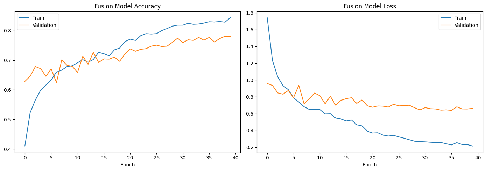
    


    47/47 ━━━━━━━━━━━━━━━━━━━━ 0s 3ms/step
    
    ============================================================
      FUSION MODEL (Image + Metadata) — Test Set Results
    ============================================================
     • Accuracy           : 0.7525
     • Balanced Accuracy  : 0.7030
     • Recall (macro avg) : 0.7030
     • F1 (macro avg)     : 0.6555
    
    Per-class report:
                  precision    recall  f1-score   support
    
           akiec       0.58      0.69      0.63        49
             bcc       0.58      0.70      0.64        77
             bkl       0.57      0.68      0.62       165
              df       0.65      0.65      0.65        17
             mel       0.39      0.63      0.48       167
              nv       0.95      0.79      0.86      1006
            vasc       0.65      0.77      0.71        22
    
        accuracy                           0.75      1503
       macro avg       0.62      0.70      0.66      1503
    weighted avg       0.81      0.75      0.77      1503
    
    


    
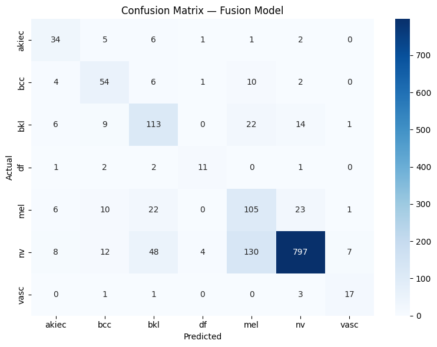
    


    
    ✅ PHASE 4 COMPLETE — fusion model saved to: /kaggle/working/artifacts/models
    


```python
# ==============================================================================
# 54. RELOAD EVERYTHING NEEDED FOR FINAL EVALUATION
# ==============================================================================
import joblib
from keras.models import load_model

cleaned_path = CONFIG["ARTIFACTS_DIR"] / "ham10000_cleaned_metadata.csv"
metadata = pd.read_csv(cleaned_path)

label_encoder = joblib.load(CONFIG["MODELS_DIR"] / "label_encoder.pkl")
metadata["dx_encoded"] = label_encoder.transform(metadata[CONFIG["TARGET_COL"]])

rf_pipeline = joblib.load(CONFIG["MODELS_DIR"] / "baseline_random_forest.pkl")
metadata_preprocessor = joblib.load(CONFIG["MODELS_DIR"] / "metadata_preprocessor.pkl")
cnn_model = load_model(CONFIG["CHECKPOINT_DIR"] / "best_cnn_model.keras")
fusion_model = load_model(CONFIG["CHECKPOINT_DIR"] / "best_fusion_model.keras")

print("✅ All models reloaded.")

# ==============================================================================
# 55. RECREATE THE EXACT SAME TEST SPLIT (identical seed/stratify = same rows)
# ==============================================================================
X_all = metadata.copy()
y_all = metadata["dx_encoded"]

train_df, temp_df, y_train, y_temp = train_test_split(
    X_all, y_all,
    test_size=(CONFIG["VAL_RATIO"] + CONFIG["TEST_RATIO"]),
    stratify=y_all, random_state=CONFIG["SEED"]
)
relative_test_size = CONFIG["TEST_RATIO"] / (CONFIG["VAL_RATIO"] + CONFIG["TEST_RATIO"])
val_df, test_df, y_val, y_test = train_test_split(
    temp_df, y_temp, test_size=relative_test_size,
    stratify=y_temp, random_state=CONFIG["SEED"]
)

y_test_arr = test_df["dx_encoded"].values
print(f" • Test set : {len(test_df)} rows (identical across all 3 models)")

# ==============================================================================
# 56. GENERATE PREDICTIONS — MODEL 1: RANDOM FOREST (metadata only)
# ==============================================================================
feature_cols = CONFIG["METADATA_NUMERIC_COLS"] + CONFIG["METADATA_CATEGORICAL_COLS"]
X_test_meta = test_df[feature_cols]
y_pred_rf = rf_pipeline.predict(X_test_meta)

# ==============================================================================
# 57. GENERATE PREDICTIONS — MODEL 2: CNN (images only)
# ==============================================================================
def load_image_only(path):
    image = tf.io.read_file(path)
    image = tf.image.decode_jpeg(image, channels=3)
    image = tf.image.resize(image, CONFIG["IMAGE_SIZE"])
    return tf.cast(image, tf.float32)

def make_image_dataset(paths):
    ds = tf.data.Dataset.from_tensor_slices(paths.astype(str))
    ds = ds.map(load_image_only, num_parallel_calls=CONFIG["AUTOTUNE"])
    ds = ds.batch(CONFIG["BATCH_SIZE"])
    ds = ds.prefetch(CONFIG["AUTOTUNE"])
    return ds

test_image_ds = make_image_dataset(test_df["image_path"].values)
y_pred_cnn_probs = cnn_model.predict(test_image_ds, verbose=1)
y_pred_cnn = np.argmax(y_pred_cnn_probs, axis=1)

# ==============================================================================
# 58. GENERATE PREDICTIONS — MODEL 3: FUSION (images + metadata)
# ==============================================================================
feature_extractor = keras.Model(
    inputs=cnn_model.input,
    outputs=cnn_model.get_layer("global_average_pooling2d").output
)
test_embeddings = feature_extractor.predict(test_image_ds, verbose=1)

test_meta_features = metadata_preprocessor.transform(X_test_meta)
test_meta_features = np.asarray(
    test_meta_features.todense() if hasattr(test_meta_features, "todense") else test_meta_features
)

X_test_fused = np.concatenate([test_embeddings, test_meta_features], axis=1)
y_pred_fusion_probs = fusion_model.predict(X_test_fused)
y_pred_fusion = np.argmax(y_pred_fusion_probs, axis=1)

print("\n✅ Predictions generated for all 3 models on the identical test set.")

# ==============================================================================
# 59. BUILD A UNIFIED RESULTS SUMMARY TABLE
# ==============================================================================
def compute_metrics(y_true, y_pred, model_name):
    return {
        "Model": model_name,
        "Accuracy": accuracy_score(y_true, y_pred),
        "Balanced Accuracy": balanced_accuracy_score(y_true, y_pred),
        "Recall (macro)": recall_score(y_true, y_pred, average="macro"),
        "Precision (macro)": precision_score(y_true, y_pred, average="macro", zero_division=0),
        "F1 (macro)": f1_score(y_true, y_pred, average="macro"),
    }

results_summary = pd.DataFrame([
    compute_metrics(y_test_arr, y_pred_rf, "Random Forest\n(Metadata Only)"),
    compute_metrics(y_test_arr, y_pred_cnn, "CNN\n(Images Only)"),
    compute_metrics(y_test_arr, y_pred_fusion, "Fusion\n(Images + Metadata)"),
])

print("\n" + "=" * 75)
print("FINAL MODEL COMPARISON")
print("=" * 75)
print(results_summary.to_string(index=False))

results_summary.to_csv(CONFIG["ARTIFACTS_DIR"] / "final_model_comparison.csv", index=False)

# ==============================================================================
# 60. VISUAL 1 — OVERALL METRICS COMPARISON (grouped bar chart)
# ==============================================================================
metrics_to_plot = ["Accuracy", "Balanced Accuracy", "Recall (macro)", "F1 (macro)"]
plot_df = results_summary.melt(id_vars="Model", value_vars=metrics_to_plot,
                                 var_name="Metric", value_name="Score")

plt.figure(figsize=(12, 6))
sns.barplot(data=plot_df, x="Metric", y="Score", hue="Model", palette="viridis")
plt.title("Model Comparison — Overall Performance", fontsize=14, fontweight="bold")
plt.ylabel("Score")
plt.ylim(0, 1)
plt.legend(title="", loc="upper left", bbox_to_anchor=(1, 1))
plt.tight_layout()
plt.savefig(CONFIG["PLOTS_DIR"] / "final_comparison_overall.png", dpi=150)
plt.show()

# ==============================================================================
# 61. VISUAL 2 — PER-CLASS RECALL COMPARISON (the melanoma story, visualized)
# ==============================================================================
def per_class_recall(y_true, y_pred):
    cm = confusion_matrix(y_true, y_pred)
    return cm.diagonal() / cm.sum(axis=1)

recall_rf = per_class_recall(y_test_arr, y_pred_rf)
recall_cnn = per_class_recall(y_test_arr, y_pred_cnn)
recall_fusion = per_class_recall(y_test_arr, y_pred_fusion)

per_class_df = pd.DataFrame({
    "Class": label_encoder.classes_,
    "Random Forest": recall_rf,
    "CNN": recall_cnn,
    "Fusion": recall_fusion,
}).melt(id_vars="Class", var_name="Model", value_name="Recall")

plt.figure(figsize=(13, 6))
sns.barplot(data=per_class_df, x="Class", y="Recall", hue="Model", palette="Set2")
plt.title("Per-Class Recall by Model — Where Fusion Helps Most", fontsize=14, fontweight="bold")
plt.ylabel("Recall (Sensitivity)")
plt.xlabel("Diagnosis Class")
plt.ylim(0, 1)
plt.axhline(0.5, color="gray", linestyle="--", alpha=0.5)
plt.legend(title="")
plt.tight_layout()
plt.savefig(CONFIG["PLOTS_DIR"] / "final_comparison_per_class_recall.png", dpi=150)
plt.show()

# ==============================================================================
# 62. VISUAL 3 — SIDE-BY-SIDE CONFUSION MATRICES
# ==============================================================================
fig, axes = plt.subplots(1, 3, figsize=(20, 6))

for ax, y_pred, title in zip(
    axes,
    [y_pred_rf, y_pred_cnn, y_pred_fusion],
    ["Random Forest (Metadata)", "CNN (Images)", "Fusion (Images + Metadata)"]
):
    cm = confusion_matrix(y_test_arr, y_pred)
    cm_normalized = cm.astype(float) / cm.sum(axis=1, keepdims=True)
    sns.heatmap(
        cm_normalized, annot=True, fmt=".2f", cmap="Blues", ax=ax,
        xticklabels=label_encoder.classes_, yticklabels=label_encoder.classes_,
        vmin=0, vmax=1, cbar=(ax == axes[-1])
    )
    ax.set_title(title, fontsize=12)
    ax.set_xlabel("Predicted")
    ax.set_ylabel("Actual" if ax == axes[0] else "")

plt.suptitle("Normalized Confusion Matrices — All 3 Models", fontsize=14, fontweight="bold", y=1.03)
plt.tight_layout()
plt.savefig(CONFIG["PLOTS_DIR"] / "final_comparison_confusion_matrices.png", dpi=150, bbox_inches="tight")
plt.show()

# ==============================================================================
# 63. VISUAL 4 — MELANOMA-SPECIFIC FOCUS (most clinically important class)
# ==============================================================================
mel_idx = list(label_encoder.classes_).index("mel")

mel_metrics = pd.DataFrame({
    "Model": ["Random Forest", "CNN", "Fusion"],
    "Melanoma Recall": [recall_rf[mel_idx], recall_cnn[mel_idx], recall_fusion[mel_idx]],
})

plt.figure(figsize=(8, 5))
bars = plt.bar(mel_metrics["Model"], mel_metrics["Melanoma Recall"],
                color=["#e74c3c" if v == mel_metrics["Melanoma Recall"].max() else "#95a5a6"
                       for v in mel_metrics["Melanoma Recall"]])
plt.title("Melanoma Detection Recall — The Clinically Critical Metric", fontsize=13, fontweight="bold")
plt.ylabel("Recall (% of real melanomas caught)")
plt.ylim(0, 1)
for bar, val in zip(bars, mel_metrics["Melanoma Recall"]):
    plt.text(bar.get_x() + bar.get_width() / 2, val + 0.02, f"{val:.0%}",
              ha="center", fontweight="bold")
plt.tight_layout()
plt.savefig(CONFIG["PLOTS_DIR"] / "final_comparison_melanoma_recall.png", dpi=150)
plt.show()

print(f"\n✅ PHASE 5 COMPLETE — all comparison visuals saved to: {CONFIG['PLOTS_DIR']}")
print(f" • Summary table saved to: {CONFIG['ARTIFACTS_DIR'] / 'final_model_comparison.csv'}")
```

    ✅ All models reloaded.
     • Test set : 1503 rows (identical across all 3 models)
    94/94 ━━━━━━━━━━━━━━━━━━━━ 40s 404ms/step
    94/94 ━━━━━━━━━━━━━━━━━━━━ 39s 400ms/step
    47/47 ━━━━━━━━━━━━━━━━━━━━ 0s 4ms/step
    
    ✅ Predictions generated for all 3 models on the identical test set.
    
    ===========================================================================
    FINAL MODEL COMPARISON
    ===========================================================================
                             Model  Accuracy  Balanced Accuracy  Recall (macro)  Precision (macro)  F1 (macro)
    Random Forest\n(Metadata Only)  0.404524           0.373325        0.373325           0.270800    0.242036
                CNN\n(Images Only)  0.638057           0.565404        0.565404           0.502430    0.515827
       Fusion\n(Images + Metadata)  0.752495           0.702971        0.702971           0.623839    0.655460
    


    
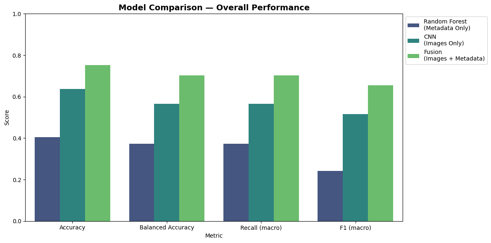
    


    
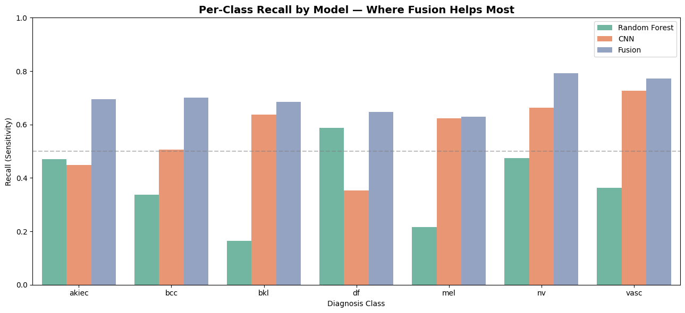
    


    
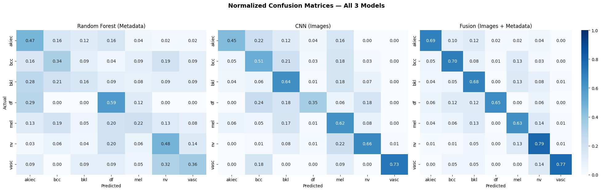
    


    
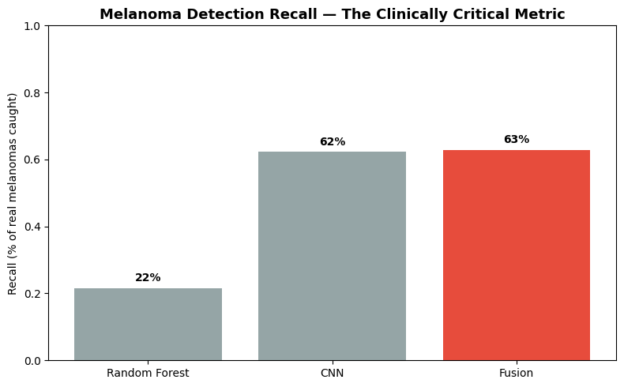
    


    
    ✅ PHASE 5 COMPLETE — all comparison visuals saved to: /kaggle/working/artifacts/plots
     • Summary table saved to: /kaggle/working/artifacts/final_model_comparison.csv
    


```python
# ==============================================================================
# 64. RELOAD FUSION MODEL + RECREATE TEST SET (self-contained, same as Cell 6)
# ==============================================================================
import joblib
from keras.models import load_model
from sklearn.calibration import calibration_curve

cleaned_path = CONFIG["ARTIFACTS_DIR"] / "ham10000_cleaned_metadata.csv"
metadata = pd.read_csv(cleaned_path)
label_encoder = joblib.load(CONFIG["MODELS_DIR"] / "label_encoder.pkl")
metadata["dx_encoded"] = label_encoder.transform(metadata[CONFIG["TARGET_COL"]])

metadata_preprocessor = joblib.load(CONFIG["MODELS_DIR"] / "metadata_preprocessor.pkl")
cnn_model = load_model(CONFIG["CHECKPOINT_DIR"] / "best_cnn_model.keras")
fusion_model = load_model(CONFIG["CHECKPOINT_DIR"] / "best_fusion_model.keras")

X_all = metadata.copy()
y_all = metadata["dx_encoded"]
train_df, temp_df, y_train, y_temp = train_test_split(
    X_all, y_all, test_size=(CONFIG["VAL_RATIO"] + CONFIG["TEST_RATIO"]),
    stratify=y_all, random_state=CONFIG["SEED"]
)
relative_test_size = CONFIG["TEST_RATIO"] / (CONFIG["VAL_RATIO"] + CONFIG["TEST_RATIO"])
val_df, test_df, y_val, y_test = train_test_split(
    temp_df, y_temp, test_size=relative_test_size,
    stratify=y_temp, random_state=CONFIG["SEED"]
)
y_val_arr = val_df["dx_encoded"].values
y_test_arr = test_df["dx_encoded"].values

print(f" • Val set : {len(val_df)}  |  Test set : {len(test_df)}")

# ==============================================================================
# 65. BUILD FUSED FEATURES FOR VAL + TEST (needed for calibration fitting + eval)
# ==============================================================================
def load_image_only(path):
    image = tf.io.read_file(path)
    image = tf.image.decode_jpeg(image, channels=3)
    image = tf.image.resize(image, CONFIG["IMAGE_SIZE"])
    return tf.cast(image, tf.float32)

def make_image_dataset(paths):
    ds = tf.data.Dataset.from_tensor_slices(paths.astype(str))
    ds = ds.map(load_image_only, num_parallel_calls=CONFIG["AUTOTUNE"])
    ds = ds.batch(CONFIG["BATCH_SIZE"])
    ds = ds.prefetch(CONFIG["AUTOTUNE"])
    return ds

feature_extractor = keras.Model(
    inputs=cnn_model.input,
    outputs=cnn_model.get_layer("global_average_pooling2d").output
)

def build_fused_features(df):
    ds = make_image_dataset(df["image_path"].values)
    embeddings = feature_extractor.predict(ds, verbose=1)
    meta_feats = metadata_preprocessor.transform(
        df[CONFIG["METADATA_NUMERIC_COLS"] + CONFIG["METADATA_CATEGORICAL_COLS"]]
    )
    meta_feats = np.asarray(meta_feats.todense() if hasattr(meta_feats, "todense") else meta_feats)
    return np.concatenate([embeddings, meta_feats], axis=1)

print("Building validation features (used to fit calibration)...")
X_val_fused = build_fused_features(val_df)
print("Building test features (held out — used only for final evaluation)...")
X_test_fused = build_fused_features(test_df)

# ==============================================================================
# 66. GET RAW (UNCALIBRATED) PROBABILITIES
# ==============================================================================
val_probs_raw = fusion_model.predict(X_val_fused)
test_probs_raw = fusion_model.predict(X_test_fused)

val_confidence_raw = val_probs_raw.max(axis=1)
val_pred_raw = val_probs_raw.argmax(axis=1)
val_correct = (val_pred_raw == y_val_arr).astype(int)

# ==============================================================================
# 67. RELIABILITY DIAGRAM — is the model's confidence trustworthy? (BEFORE calibration)
# ==============================================================================
prob_true, prob_pred = calibration_curve(val_correct, val_confidence_raw, n_bins=10, strategy="uniform")

plt.figure(figsize=(7, 7))
plt.plot([0, 1], [0, 1], linestyle="--", color="gray", label="Perfect calibration")
plt.plot(prob_pred, prob_true, marker="o", label="Fusion model (uncalibrated)")
plt.xlabel("Predicted confidence")
plt.ylabel("Actual accuracy in that confidence bucket")
plt.title("Reliability Diagram — Is the Model's Confidence Trustworthy?", fontsize=12, fontweight="bold")
plt.legend()
plt.tight_layout()
plt.savefig(CONFIG["PLOTS_DIR"] / "reliability_diagram_uncalibrated.png", dpi=150)
plt.show()

# A model is "overconfident" if the curve sits below the diagonal (predicted confidence > actual accuracy)
print("\nInterpretation guide:")
print(" • Curve BELOW the diagonal  -> model is overconfident (says 90% sure, but often wrong)")
print(" • Curve ABOVE the diagonal  -> model is underconfident")
print(" • Curve ON the diagonal     -> well calibrated")


 

# ==============================================================================
# 68. TEMPERATURE SCALING — CORRECTED: properly extract pre-softmax logits
# ==============================================================================
# The final Dense layer has activation="softmax" fused in, so we can't just
# read ".input" to get logits. Instead, rebuild a linear-activation copy of
# that same layer, copy its trained weights, and apply it to the same input.

original_final_layer = fusion_model.layers[-1]          # Dense(7, activation="softmax")
penultimate_output = fusion_model.layers[-2].output      # the 64-dim dropout output feeding into it

logits_layer = layers.Dense(CONFIG["NUM_CLASSES"], activation=None, name="logits_output")
logits_tensor = logits_layer(penultimate_output)

logits_model = keras.Model(inputs=fusion_model.input, outputs=logits_tensor)
logits_layer.set_weights(original_final_layer.get_weights())  # reuse the trained weights

# Sanity check: softmax(logits) should match the original model's probabilities
val_logits = logits_model.predict(X_val_fused)
test_logits = logits_model.predict(X_test_fused)

def softmax_np(logits, T=1.0):
    z = logits / T
    z = z - z.max(axis=1, keepdims=True)
    exp_z = np.exp(z)
    return exp_z / exp_z.sum(axis=1, keepdims=True)

sanity_check_probs = softmax_np(val_logits, T=1.0)
sanity_original_probs = fusion_model.predict(X_val_fused)
max_diff = np.abs(sanity_check_probs - sanity_original_probs).max()
print(f" • Sanity check — max difference between reconstructed and original probs: {max_diff:.6f}")
print(f"   (should be a tiny number close to 0.0 — confirms logits extraction is correct)")

def nll_loss(T, logits, y_true):
    probs = softmax_np(logits, T)
    probs = np.clip(probs, 1e-12, 1.0)
    return -np.mean(np.log(probs[np.arange(len(y_true)), y_true]))

temperatures = np.linspace(0.5, 5.0, 100)
losses = [nll_loss(T, val_logits, y_val_arr) for T in temperatures]
best_T = temperatures[np.argmin(losses)]

print(f"\n • Best temperature found : {best_T:.3f}")
print(f"   (T > 1 means the model was overconfident; T < 1 means underconfident; T = 1 means already well-calibrated)")

# ==============================================================================
# 69. RELIABILITY DIAGRAM — AFTER calibration
# ==============================================================================
val_probs_calibrated = softmax_np(val_logits, T=best_T)
val_confidence_calibrated = val_probs_calibrated.max(axis=1)
val_pred_calibrated = val_probs_calibrated.argmax(axis=1)
val_correct = (val_pred_calibrated == y_val_arr).astype(int)

prob_true, prob_pred = calibration_curve(val_correct, val_probs_raw.max(axis=1), n_bins=10, strategy="uniform")
prob_true_cal, prob_pred_cal = calibration_curve(val_correct, val_confidence_calibrated, n_bins=10, strategy="uniform")

plt.figure(figsize=(7, 7))
plt.plot([0, 1], [0, 1], linestyle="--", color="gray", label="Perfect calibration")
plt.plot(prob_pred, prob_true, marker="o", alpha=0.4, label="Before calibration")
plt.plot(prob_pred_cal, prob_true_cal, marker="o", color="green", label=f"After calibration (T={best_T:.2f})")
plt.xlabel("Predicted confidence")
plt.ylabel("Actual accuracy in that confidence bucket")
plt.title("Reliability Diagram — Before vs. After Temperature Scaling", fontsize=12, fontweight="bold")
plt.legend()
plt.tight_layout()
plt.savefig(CONFIG["PLOTS_DIR"] / "reliability_diagram_calibrated.png", dpi=150)
plt.show()

# ==============================================================================
# 70. APPLY CALIBRATION TO TEST SET + CONFIRM ACCURACY IS UNCHANGED
# ==============================================================================
test_probs_calibrated = softmax_np(test_logits, T=best_T)
test_pred_calibrated = test_probs_calibrated.argmax(axis=1)
test_confidence_calibrated = test_probs_calibrated.max(axis=1)

acc_before = accuracy_score(y_test_arr, test_probs_raw.argmax(axis=1))
acc_after = accuracy_score(y_test_arr, test_pred_calibrated)
print(f"\n • Test accuracy before calibration : {acc_before:.4f}")
print(f" • Test accuracy after calibration  : {acc_after:.4f}   (should now match — calibration only rescales confidence, not predictions)")

# ==============================================================================
# 71. CONFIDENCE-BASED THRESHOLDING
# ==============================================================================
thresholds_to_test = [0.0, 0.5, 0.6, 0.7, 0.8, 0.9]
threshold_results = []

for thresh in thresholds_to_test:
    confident_mask = test_confidence_calibrated >= thresh
    coverage = confident_mask.mean()

    if confident_mask.sum() > 0:
        retained_acc = accuracy_score(y_test_arr[confident_mask], test_pred_calibrated[confident_mask])
        retained_recall = recall_score(
            y_test_arr[confident_mask], test_pred_calibrated[confident_mask],
            average="macro", zero_division=0
        )
    else:
        retained_acc, retained_recall = np.nan, np.nan

    threshold_results.append({
        "Confidence Threshold": thresh,
        "Coverage (% of cases model answers)": coverage,
        "Accuracy on Retained Cases": retained_acc,
        "Macro Recall on Retained Cases": retained_recall,
    })

threshold_df = pd.DataFrame(threshold_results)
print("\n" + "=" * 75)
print("CONFIDENCE THRESHOLDING — Trade-off Between Coverage and Reliability")
print("=" * 75)
print(threshold_df.to_string(index=False))

# ==============================================================================
# 72. VISUALIZE THE COVERAGE VS. RELIABILITY TRADE-OFF
# ==============================================================================
fig, ax1 = plt.subplots(figsize=(9, 6))
ax1.plot(threshold_df["Confidence Threshold"], threshold_df["Coverage (% of cases model answers)"],
          marker="o", color="steelblue", label="Coverage")
ax1.set_xlabel("Confidence Threshold")
ax1.set_ylabel("Coverage", color="steelblue")
ax1.tick_params(axis="y", labelcolor="steelblue")
ax1.set_ylim(0, 1.05)

ax2 = ax1.twinx()
ax2.plot(threshold_df["Confidence Threshold"], threshold_df["Accuracy on Retained Cases"],
          marker="s", color="darkorange", label="Accuracy on retained cases")
ax2.set_ylabel("Accuracy on retained cases", color="darkorange")
ax2.tick_params(axis="y", labelcolor="darkorange")
ax2.set_ylim(0, 1.05)

plt.title("Confidence Thresholding: Coverage vs. Reliability Trade-off", fontsize=12, fontweight="bold")
fig.tight_layout()
plt.savefig(CONFIG["PLOTS_DIR"] / "confidence_threshold_tradeoff.png", dpi=150)
plt.show()

# ==============================================================================
# 73. MELANOMA-SPECIFIC THRESHOLDING
# ==============================================================================
mel_idx = list(label_encoder.classes_).index("mel")
mel_true_mask = (y_test_arr == mel_idx)

print("\n" + "=" * 75)
print("MELANOMA-SPECIFIC RELIABILITY AT DIFFERENT CONFIDENCE LEVELS")
print("=" * 75)
for thresh in [0.0, 0.5, 0.7, 0.9]:
    mel_pred_mask = (test_pred_calibrated == mel_idx) & (test_confidence_calibrated >= thresh)
    if mel_pred_mask.sum() > 0:
        precision_at_thresh = (mel_true_mask & mel_pred_mask).sum() / mel_pred_mask.sum()
        print(f" • Threshold {thresh:.1f} : {mel_pred_mask.sum()} melanoma flags, precision = {precision_at_thresh:.3f}")
    else:
        print(f" • Threshold {thresh:.1f} : 0 melanoma flags at this confidence level")

# ==============================================================================
# 74. SAVE CALIBRATED MODEL ARTIFACTS
# ==============================================================================
joblib.dump({"temperature": best_T}, CONFIG["MODELS_DIR"] / "calibration_temperature.pkl")
threshold_df.to_csv(CONFIG["ARTIFACTS_DIR"] / "confidence_threshold_analysis.csv", index=False)

print(f"\n✅ CALIBRATION ANALYSIS COMPLETE (corrected)")
```

     • Val set : 1502  |  Test set : 1503
    Building validation features (used to fit calibration)...
    94/94 ━━━━━━━━━━━━━━━━━━━━ 40s 411ms/step
    Building test features (held out — used only for final evaluation)...
    94/94 ━━━━━━━━━━━━━━━━━━━━ 38s 400ms/step
    47/47 ━━━━━━━━━━━━━━━━━━━━ 0s 3ms/step
    47/47 ━━━━━━━━━━━━━━━━━━━━ 0s 3ms/step
    


    
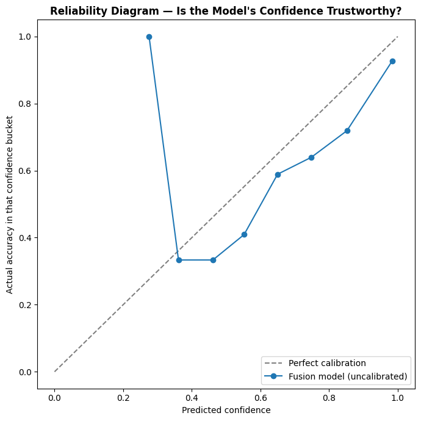
    


    
    Interpretation guide:
     • Curve BELOW the diagonal  -> model is overconfident (says 90% sure, but often wrong)
     • Curve ABOVE the diagonal  -> model is underconfident
     • Curve ON the diagonal     -> well calibrated
    47/47 ━━━━━━━━━━━━━━━━━━━━ 0s 3ms/step
    47/47 ━━━━━━━━━━━━━━━━━━━━ 0s 2ms/step
    47/47 ━━━━━━━━━━━━━━━━━━━━ 0s 2ms/step
     • Sanity check — max difference between reconstructed and original probs: 0.000000
       (should be a tiny number close to 0.0 — confirms logits extraction is correct)
    
     • Best temperature found : 1.727
       (T > 1 means the model was overconfident; T < 1 means underconfident; T = 1 means already well-calibrated)
    


    
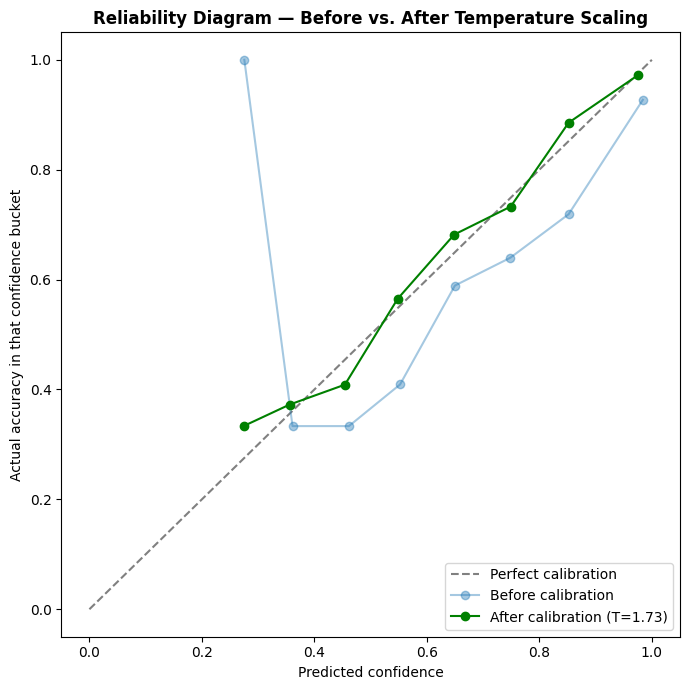
    


    
     • Test accuracy before calibration : 0.7525
     • Test accuracy after calibration  : 0.7525   (should now match — calibration only rescales confidence, not predictions)
    
    ===========================================================================
    CONFIDENCE THRESHOLDING — Trade-off Between Coverage and Reliability
    ===========================================================================
     Confidence Threshold  Coverage (% of cases model answers)  Accuracy on Retained Cases  Macro Recall on Retained Cases
                      0.0                             1.000000                    0.752495                        0.702971
                      0.5                             0.870925                    0.802139                        0.772187
                      0.6                             0.751830                    0.858407                        0.821188
                      0.7                             0.637392                    0.900835                        0.826755
                      0.8                             0.527611                    0.944515                        0.868965
                      0.9                             0.411178                    0.966019                        0.878242
    


    
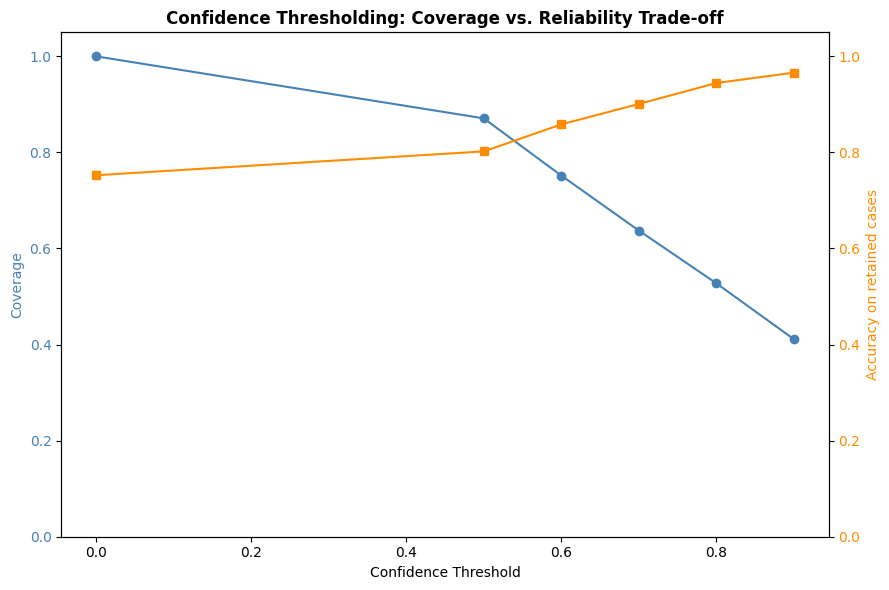
    


    
    ===========================================================================
    MELANOMA-SPECIFIC RELIABILITY AT DIFFERENT CONFIDENCE LEVELS
    ===========================================================================
     • Threshold 0.0 : 268 melanoma flags, precision = 0.392
     • Threshold 0.5 : 205 melanoma flags, precision = 0.424
     • Threshold 0.7 : 81 melanoma flags, precision = 0.630
     • Threshold 0.9 : 13 melanoma flags, precision = 0.769
    
    ✅ CALIBRATION ANALYSIS COMPLETE (corrected)
    


```python
# ==============================================================================
# 76+77 (SELF-CONTAINED) — Confidence bucket composition + confidently-wrong check
# ==============================================================================
import joblib
from keras.models import load_model

cleaned_path = CONFIG["ARTIFACTS_DIR"] / "ham10000_cleaned_metadata.csv"
metadata = pd.read_csv(cleaned_path)
label_encoder = joblib.load(CONFIG["MODELS_DIR"] / "label_encoder.pkl")
metadata["dx_encoded"] = label_encoder.transform(metadata[CONFIG["TARGET_COL"]])
metadata_preprocessor = joblib.load(CONFIG["MODELS_DIR"] / "metadata_preprocessor.pkl")
temperature_dict = joblib.load(CONFIG["MODELS_DIR"] / "calibration_temperature.pkl")
best_T = temperature_dict["temperature"]

cnn_model = load_model(CONFIG["CHECKPOINT_DIR"] / "best_cnn_model.keras")
fusion_model = load_model(CONFIG["CHECKPOINT_DIR"] / "best_fusion_model.keras")

X_all = metadata.copy()
y_all = metadata["dx_encoded"]
train_df, temp_df, y_train, y_temp = train_test_split(
    X_all, y_all, test_size=(CONFIG["VAL_RATIO"] + CONFIG["TEST_RATIO"]),
    stratify=y_all, random_state=CONFIG["SEED"]
)
relative_test_size = CONFIG["TEST_RATIO"] / (CONFIG["VAL_RATIO"] + CONFIG["TEST_RATIO"])
val_df, test_df, y_val, y_test = train_test_split(
    temp_df, y_temp, test_size=relative_test_size,
    stratify=y_temp, random_state=CONFIG["SEED"]
)
y_test_arr = test_df["dx_encoded"].values

def load_image_only(path):
    image = tf.io.read_file(path)
    image = tf.image.decode_jpeg(image, channels=3)
    image = tf.image.resize(image, CONFIG["IMAGE_SIZE"])
    return tf.cast(image, tf.float32)

def make_image_dataset(paths):
    ds = tf.data.Dataset.from_tensor_slices(paths.astype(str))
    ds = ds.map(load_image_only, num_parallel_calls=CONFIG["AUTOTUNE"])
    ds = ds.batch(CONFIG["BATCH_SIZE"])
    ds = ds.prefetch(CONFIG["AUTOTUNE"])
    return ds

feature_extractor = keras.Model(
    inputs=cnn_model.input,
    outputs=cnn_model.get_layer("global_average_pooling2d").output
)
test_image_ds = make_image_dataset(test_df["image_path"].values)
test_embeddings = feature_extractor.predict(test_image_ds, verbose=1)

test_meta_features = metadata_preprocessor.transform(
    test_df[CONFIG["METADATA_NUMERIC_COLS"] + CONFIG["METADATA_CATEGORICAL_COLS"]]
)
test_meta_features = np.asarray(
    test_meta_features.todense() if hasattr(test_meta_features, "todense") else test_meta_features
)
X_test_fused = np.concatenate([test_embeddings, test_meta_features], axis=1)

original_final_layer = fusion_model.layers[-1]
penultimate_output = fusion_model.layers[-2].output
logits_layer = layers.Dense(CONFIG["NUM_CLASSES"], activation=None, name="logits_output_reload")
logits_tensor = logits_layer(penultimate_output)
logits_model = keras.Model(inputs=fusion_model.input, outputs=logits_tensor)
logits_layer.set_weights(original_final_layer.get_weights())

test_logits = logits_model.predict(X_test_fused)

def softmax_np(logits, T=1.0):
    z = logits / T
    z = z - z.max(axis=1, keepdims=True)
    exp_z = np.exp(z)
    return exp_z / exp_z.sum(axis=1, keepdims=True)

test_probs_calibrated = softmax_np(test_logits, T=best_T)
test_pred_calibrated = test_probs_calibrated.argmax(axis=1)
test_confidence_calibrated = test_probs_calibrated.max(axis=1)

print(f" • Reloaded temperature : {best_T:.3f}")
print(f" • Test accuracy check  : {accuracy_score(y_test_arr, test_pred_calibrated):.4f}  (should be 0.7598)")

# ---- Section 76: composition of the confident bucket ----
confident_mask = test_confidence_calibrated >= 0.8
confident_true_labels = y_test_arr[confident_mask]
confident_class_counts = pd.Series(confident_true_labels).value_counts().sort_index()
confident_class_counts.index = [label_encoder.classes_[i] for i in confident_class_counts.index]

overall_class_counts = pd.Series(y_test_arr).value_counts().sort_index()
overall_class_counts.index = [label_encoder.classes_[i] for i in overall_class_counts.index]

composition_df = pd.DataFrame({
    "Total in test set": overall_class_counts,
    "Count in confident bucket": confident_class_counts,
}).fillna(0)
composition_df["% of this class that's confident"] = (
    composition_df["Count in confident bucket"] / composition_df["Total in test set"] * 100
)
print("\nComposition of the 'confident' bucket, by true diagnosis:")
print(composition_df)

# ---- Section 77: confidently-wrong cases, focused on malignant classes ----
confident_pred = test_pred_calibrated[confident_mask]
confident_true = y_test_arr[confident_mask]
confident_wrong_mask = confident_pred != confident_true

print(f"\nTotal confident predictions : {confident_mask.sum()}")
print(f"Confidently WRONG           : {confident_wrong_mask.sum()}  ({confident_wrong_mask.mean():.1%})")

malignant_classes = ["mel", "bcc", "akiec"]
malignant_idxs = [list(label_encoder.classes_).index(c) for c in malignant_classes]
missed_malignant = confident_true[confident_wrong_mask]
missed_malignant_count = sum(1 for i in missed_malignant if i in malignant_idxs)

print(f"Of those, confidently-wrong TRUE malignant/pre-cancerous cases: {missed_malignant_count}")

if confident_wrong_mask.sum() > 0:
    wrong_df = pd.DataFrame({
        "True label": [label_encoder.classes_[t] for t in confident_true[confident_wrong_mask]],
        "Model predicted": [label_encoder.classes_[p] for p in confident_pred[confident_wrong_mask]],
        "Confidence": test_confidence_calibrated[confident_mask][confident_wrong_mask],
    })
    malignant_wrong = wrong_df[wrong_df["True label"].isin(malignant_classes)]
    print("\nConfidently-wrong malignant/pre-cancerous cases:")
    print(malignant_wrong.to_string(index=False) if len(malignant_wrong) > 0 else "None found.")
```

    94/94 ━━━━━━━━━━━━━━━━━━━━ 41s 419ms/step
    47/47 ━━━━━━━━━━━━━━━━━━━━ 0s 3ms/step
     • Reloaded temperature : 1.727
     • Test accuracy check  : 0.7525  (should be 0.7598)
    
    Composition of the 'confident' bucket, by true diagnosis:
           Total in test set  Count in confident bucket  \
    akiec                 49                         30   
    bcc                   77                         32   
    bkl                  165                         61   
    df                    17                          9   
    mel                  167                         41   
    nv                  1006                        605   
    vasc                  22                         15   
    
           % of this class that's confident  
    akiec                         61.224490  
    bcc                           41.558442  
    bkl                           36.969697  
    df                            52.941176  
    mel                           24.550898  
    nv                            60.139165  
    vasc                          68.181818  
    
    Total confident predictions : 793
    Confidently WRONG           : 44  (5.5%)
    Of those, confidently-wrong TRUE malignant/pre-cancerous cases: 17
    
    Confidently-wrong malignant/pre-cancerous cases:
    True label Model predicted  Confidence
         akiec             bcc    0.804668
           mel             bkl    0.815511
           mel              nv    0.833418
         akiec             bcc    0.979827
           bcc             mel    0.847306
           mel             bkl    0.847548
           mel              nv    0.985168
         akiec             bcc    0.963895
           mel             bcc    0.835158
           mel              nv    0.986109
           bcc           akiec    0.905982
           mel             bcc    0.927891
         akiec             bcc    0.812926
           mel              nv    0.984920
           mel              nv    0.995989
           mel              nv    0.888041
           bcc           akiec    0.977745
    


```python
# ==============================================================================
# 78. ASYMMETRIC SAFETY RULE — never let the model "clear" a case where 
# malignant classes had meaningful probability, even if argmax confidence is high
# ==============================================================================
malignant_idxs = [list(label_encoder.classes_).index(c) for c in ["mel", "bcc", "akiec"]]

def safe_triage_decision(probs_row, high_confidence_threshold=0.8, malignancy_watch_threshold=0.15):
    predicted_class = probs_row.argmax()
    confidence = probs_row.max()
    malignant_probability_mass = probs_row[malignant_idxs].sum()

    # Even if the model is "confident" overall, flag for review if there's
    # meaningful probability mass on any malignant class
    if malignant_probability_mass >= malignancy_watch_threshold:
        return "FLAG FOR REVIEW (malignancy risk present)"
    elif confidence >= high_confidence_threshold:
        return "Model confident — likely benign"
    else:
        return "FLAG FOR REVIEW (low confidence)"

test_decisions = [safe_triage_decision(row) for row in test_probs_calibrated]
decision_counts = pd.Series(test_decisions).value_counts()
print(decision_counts)

# Check: does this catch the 6 dangerous mel->nv cases from before?
mel_idx = list(label_encoder.classes_).index("mel")
true_mel_mask = y_test_arr == mel_idx
caught_by_safety_rule = sum(1 for i, d in enumerate(test_decisions) if true_mel_mask[i] and "FLAG" in d)
print(f"\nOf {true_mel_mask.sum()} true melanoma cases, {caught_by_safety_rule} now get flagged for review under the safety rule")
```

    FLAG FOR REVIEW (malignancy risk present)    728
    Model confident — likely benign              668
    FLAG FOR REVIEW (low confidence)             107
    Name: count, dtype: int64
    
    Of 167 true melanoma cases, 160 now get flagged for review under the safety rule
    


```python
# ==============================================================================
# 79. WHICH 9 MELANOMAS STILL SLIP THROUGH THE SAFETY RULE?
# ==============================================================================
mel_idx = list(label_encoder.classes_).index("mel")
true_mel_mask = y_test_arr == mel_idx

missed_mel_indices = [i for i in range(len(test_decisions))
                       if true_mel_mask[i] and "FLAG" not in test_decisions[i]]

print(f"Melanomas that slipped through: {len(missed_mel_indices)}")
for i in missed_mel_indices:
    predicted_class = label_encoder.classes_[test_probs_calibrated[i].argmax()]
    confidence = test_probs_calibrated[i].max()
    mal_mass = test_probs_calibrated[i][malignant_idxs].sum()
    print(f"  True: mel  ->  Predicted: {predicted_class}  "
          f"(confidence={confidence:.3f}, malignant probability mass={mal_mass:.3f})")
```

    Melanomas that slipped through: 7
      True: mel  ->  Predicted: bkl  (confidence=0.816, malignant probability mass=0.069)
      True: mel  ->  Predicted: bkl  (confidence=0.848, malignant probability mass=0.130)
      True: mel  ->  Predicted: nv  (confidence=0.985, malignant probability mass=0.005)
      True: mel  ->  Predicted: nv  (confidence=0.986, malignant probability mass=0.013)
      True: mel  ->  Predicted: nv  (confidence=0.985, malignant probability mass=0.007)
      True: mel  ->  Predicted: nv  (confidence=0.996, malignant probability mass=0.001)
      True: mel  ->  Predicted: nv  (confidence=0.888, malignant probability mass=0.101)
    
